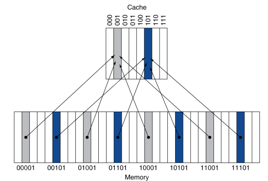
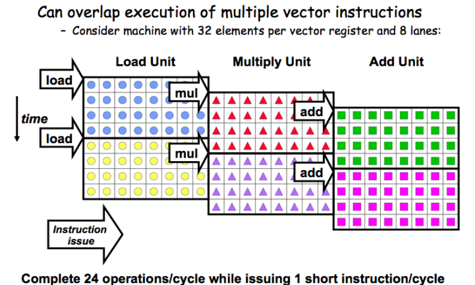
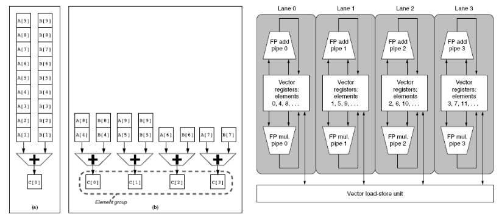
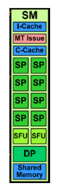

 Resumos

## A saber(Revisões)

- numerical data representation (for error analysis)
- ISA (Instruction Set Architecture)
- how C compilers generate code (a look into assembly code)
	- how scalar and structured data are allocated
	- how control structures are implemented
	- how to call/return from function/procedures
	- what architecture features impact performance
- Improvements to enhance performance in a single CPU
	- ILP: pipeline, multiple issue, …
	- data parallelism: SIMD/vector processing, ...
	- memory hierarchy: cache levels, ...
	- thread-level parallelism

## Outros

NUMA: O processo de execução verá os dois blocos de memória como um, contudo é necessário ter o cuidado de saber onde está os dados para cada "processo"(pedaço de código) de cada chip visto haver delay ao aceder ao bloco de memória do outro chip

Intel P6/Core:
- duas unidades:
    - unidade de controlo de instruções
    - unidade de execução
- Já permite ILP de grau 6 (6 unidades funcionais)
    - dependência de instruções, apenas permite, em média, 2 instruções por ciclo 

L3 não inclusivo carrega diretamente de memória para L2 e depois L2 guarda se precisar em L3

## Compreensão do desempenho

- Algoritmo + estrutura de dados
	- Algoritmo: determina o número de operações a executar
	- Estrutura de dados: determina quão eficiente é o acesso ao dados
- Linguagem de programação, compilador, arquitetura determina o número de instruções máquina executadas por operação
- Processador e sistema de memória determina quão rápido as instruções são executadas
- Sistema I/O, inclui OS, determina quão rápido as operações I/O são executadas
- Tempo de resposta: Quanto tempo demora a fazer uma tarefa
- Throughput: Trabalho feito por unidade de tempo

### Tempo de resposta

single core: $`CPU_{Time} = IC * CPI * T_{clock}`$
- IC é o número de ciclos: determinado por programa, ISA(Instruction set architecture) e compilador
- CPI é o número de ciclos clock médio por instrução: determinado pelo hardware do CPU
- $`T_{clock}`$ é o tempo de ciclo de clock $`T_{clock} = 1/f_{clock}`$

O desempenho é melhorado com:
- Redução do número de ciclos de clock
- Aumento da frequência

O desempenho depende de:
- Algoritmo: afeta IC e talvez CPI
- Linguagem de programação: afeta IC e CPI
- Compilador: afeta IC e CPI
- ISA: afeta IC, CPI, e $`T_{clock}`$
- Desenho do processador

## Pipeline

Pipeline melhora desempenho ao aumentar o troughput de instruções

Cada instrução tem a mesma latência

Desenho do Instruction Set afeta complexidade da implementação do pipeline

## ILP (Instruction Level Parallelism)

executa multiplas instruções em paralelo

Multiplos pipelines

Ao explorar ILP o objetivo é diminuir o CPI

Os programas tem dependências que limitam o IPL (ver slides a partir do slide 19 para ver as limitações (Background2.pdf))

Out-of-order execution permite lançar(fora de ordem) instruções independentes entre si (hardware dedicado e mais complexo)

Número de instruções por ciclo limitada pela quantidade e tipo de unidades funcionais

Loop unroll permite reduzir número de ciclos e, consequentemente, cycle overhead(comparação e incrementação)
- lidar com elementos restantes pós-loop
- não há dependências entre loads
- apenas melhora adição de inteiros

Loop unroll com paralelismo para operações associativas(Iteration Splitting): acumular em duas variáveis $`->`$ merge no fim

Para alcançar $`CPI<1`$ é necessário completar multiplas instruções por cada ciclo de clock

ILP para Multi-threading: multiple issue + dynamic scheduling

## Multi-threading

Executa várias threads em paralelo

Exige:
- muitos registos $`->`$ register spilling
- Replicação de hardware: registos , PC/IP, etc
- Troca rápida entre threads

Fine-grain multithreading:
- Troca threads após cada ciclo
- Interleave instruction execution
- Se uma thread stalls, outras são executadas

Coarse-grain multithreading:
- Apenas troca num stall longo
- Simplifica hardware, mas não esconde pequenos stalls

Simultaneous Multithreading(SMT):
- Processador multiple-issue dynamically scheduled:
    - Instruções agendadas de multiplas threads
    - Instruções de threads independentes executam quando unidades funcionais estão disponiveis
    - Dentro das threads, dependências tratadas por agendamento(scheduling) e renomeação de registos(register renaming)

## Hierarquia de Memória

Programadores querem quantidades ilimitadas de memória com baixa latência

Memória rápida é mais cara por bit do que memória lenta

Solução: organizar o sistema de memória numa hierarquia
- Todo o espaço de memória endereçável disponível em maior e mais lenta memória
- Memórias incrementalmente menores e mais rápidas em direção ao processador, cada uma contendo um subset da memória abaixo

Localidade temporal e espacial asegura que quase todas as referências possam ser encontradas em memórias menores, dá a ilusão de uma maior, e rápida memória

Linha de cache(Block): unidade de cópia (atualmente o normal é ser 64 bytes)

Se os dados a aceder está presente no nível superior: Hit ($`Hit ratio = hits / accesses`$)

Se os dados a aceder não estão presentes: Miss (bloco copiado do nível inferior $`Miss ratio = misses/accesses = 1 - Hit ratio`$)

Conceitos transversais aos níveis da hierarquia
- Block placement (Colocação do bloco)
- Finding Block (Encontrar um Bloco)
- Replacement on a miss (Substituição em uma miss)
- Write policy (política de escrita)

cache L1 privada para o CPU, pequena mas rápida

cache L2 serve as misses da L1, maior, mais lenta, mas ainda mais rápida que a memória

cache L3 serve as misses da L2, maior, mais lenta, mas ainda mais rápida que a memória

Memória serve as misses da L2/L3

Disco rígido serve as "misses" da memória

n Sets $`->`$ n-way Set associative

Direct-mapped cache $`->`$ uma entrada por Set

Fully associative $`->`$ um Set

### Tipos de cache

#### Direct Mapped Cache (Mapeamento direto)

Localização determinada pelo endereço

Direct mapped: apenas uma escolha

(endereço) modulo (Número de linhas de cache)

Número de linhas de cache é potência de dois

Usa os bits low-order do endereço

#### n-way Set Associative

Cada set contém n entradas

Número do bloco determina o set: (Número do bloco) modulo (Número de sets na cache)

Pesquisa todas as entradas num dado set de uma vez só

n comparadores (menos caro)

#### Fully Associative (Totalmente associativo)

Permite um dado bloco ir para qualquer entrada da cache

Requer que todas as entradas sejam pesquisadas de uma vez só

Comparador por entrada (caro)

### Block placement

Determinado por associatividade:
- Direct mapped (1-way associative): apenas uma escolha para colocação
- n-way Set Associative: n escolhas dentro de um Set
- Fully Associative: qualquer local

Aumento da associatividade diminui miss rate mas com rendimentos decrescentes, bem como aumenta complexidade, custo e tempo de acesso

### Replacement (on a miss) Policy (Política de substituição)

Direct mapped: sem escolha
Set associative: preferir entrada inválida, se houver, caso contrário, escolher uma das entradas do Set. Esta escolha pode ser de duas formas:
- Least-recently used(LRU): escolher a que não foi usada à mais tempo (simples para 2-way, possível para 4-way, muito difícil a partir daí)
- Random: Dá aproximadamente o mesmo desempenho que o LRU para alta associatividade

### Write Policy (Política de escrita)

- Write-through:
    - Atualiza niveis superiores e inferiores
    - Simplifica substituição, mas pode requerer buffers de escrita
- Write-back:
    - Atualiza apenas nível superior
    - Atualiza nível inferior quando o bloco é substituido
    - Precisa de manter mais estado

Ambas as estratégias usa buffers de escrita pra fazer escritas assincronas

Virtual memory: Apenas write-back é possível, dada a latência de gravação em disco

### Tempo de resposta tendo em conta a hierarquia de memória

$`CPU_{Time} = IC * CPI * T_{clock}`$
- IC: Número de instruções executadas, assume-se constante
- CPI: clock cycles per instruction
- $`T_{clock}`$: período(tempo de ciclo) do clock $`T_{clock} = 1/f_{clock}`$, assume-se constante contudo não é, visto que se houver sobreaquecimento, o cpu baixa a frequência(aumenta o período)

Exemplo - evolução do CPI:
- Inicial: CPI = 15 
- Adição de pipeline: CPI = 1, a adição do pipeline permitiu diminuir o ciclo de clock, como tal aumentar a frequência. Permitiu diminuir porque o trabalho que é feito em cada ciclo é agora simples e pouco, visto que o pipeline divide a instrução em pedaços mais simples
- Adição de ILP: CPI = 0.2, IPL(paralelismo ao nível das instruções apesar de o código ser sequencial), possibilidade de fazer várias partes de instruções ao mesmo tempo

$`CPI = CPI_{CPU} + CPI_{mem}`$

$`CPI_{mem} = miss rate L1 * LeS rate * miss penalty L1`$

$`miss penalty L1 = (1- miss rate L2) * miss penalty L2 + miss rate L2 * miss penalty L3ouM`$
- LeS rate: percentagem de instruções que vão à memória
- miss rate: fração de acessos à cache que resultam em miss
- Notas:
    - miss rate/penalty são muitas vezes diferentes para escritas e leituras
    - processadores especulativos e multi-threaded podem executar outras instruções durante um miss, reduzindo o impacto no desempenho
    - Cache L1 está divida em duas partes, uma para dados e outra para código

### Causas de Misses (3C's + 1)

#### Compulsatory
Cache fria, primeira referência ao bloco de memória

#### Capacity (Capacidade)
Cache cheia, blocos descartados e posteriormente recuperados

#### Conflict (Conflitos)
O programa faz referências a vários endereços de diferentes blocos de memória que mapeiam para o mesmo local na cache

#### Coherency (Coerência)
Diferentes processadores devem ver o mesmo valor no mesmo local

##### Cache Coherence (Coerência de cache)

###### Coherence (Coerência)
Todas as leituras por qualquer processador devem retornar o valor escrito mais recentemente

Escritas para o mesmo local por quaisquer dois processadores são vistos na mesma ordem por todos os processadores

Coerência define o comportamento de leituras e escritas para o mesmo local de memória

###### Consistency(Consistência)
Quando um valor escrito será retornado por uma leitura

Se um processador escreve no local A seguido pelo local B, qualquer processador que veja o novo valor de B também deve ver o novo valor de A

Consistência define o comportamento de leituras e escritas em relação a acessos a outros locais de memória

##### Forçar Coerência
Caches coerentes fornecem:
- Migração: movimento dos dados
- Replicação: multiplas cópias dos dados

Protocolos de coerência de cache:
- Directory based: Status de partilha de cada linha de cache mantido num local 
- Snooping: Cada núcleo rastreia o status de partilha de cada linha de cache

### 6 otimizações básicas da cache

#### Tamanho de linha de cache maior
Reduz compulsatory misses

Aumenta capacity e conflict misses, aumenta miss penalty

#### Maior capacidade total de cache para reduzir miss rate
Aumenta hit time, aumenta consumo de energia

#### Maior associatividade
Reduz conflict misses

Aumenta hit time, aumenta consumo de energia

#### Caches multi nível para reduzir miss penalty
Reduz tempo total de acesso à memória

Atualmente L1, L2 e L3

#### Dar prioridade a read misses sobre misses de escrita
Reduz miss penalty

#### Evitar tradução de endereços na indexação da cache
Reduz hit time

### 10 otimizações avançadas

#### Redução do hit time

##### Caches de primeiro nível pequenas e simples

Critical timing path: endereçamento de memória de tags, depois comparação de tags, depois seleção do set correto

Cache de mapeamento direto pode sobrepor a comparação de tags

Menor associatividade reduz consumo de energia porque são acedidas menos linhas de cache

##### Way-prediction
Para melhorar hit time, prevê o caminho para pre-set mux
- Mis-prediction origina maior hit time
- Precisão da previsão:
    - $`> 90\%`$ para 2-way
    - $`> 80\%`$ para 4-way
    - I-cache tem melhor precisão que D-cache

Extendido para prever linha de cache
- Way selection
- Aumenta mis-prediction penalty

#### Aumentar a bandwidth da cache

##### Pipelined cache access (acessos à cache em pipeline)
Aumenta branch mis-prediction penalty

Torna mais fácil aumentar a associatividade

##### Nonblocking caches (Caches não bloqueantes)
Permite hits antes que as misses anteriores sejam concluídas
- Hit under miss
- Hit under multiple miss

L2 deve suportar

Em geral, os processadores podem esconder L1 miss penalty mas não L2 miss penalty

##### Multibanked caches
Organiza a cache como bancos independentes de modo a suportar multiplos acessos

Intercalar bancos de acordo com o endereço da linha da cache

#### Redução do miss penalty

##### Critical word first, Early Restart
Critical word first:
- Solicitar missed word primeiro da memória
- Enviar para o processador assim que chega

Early restart:
- Solicitar words em ordem normal
- Enviar missed word para o processador assim que chega

A eficácia destas estratégias depende do tamanho da linha de cache e da probabilidade de outro acesso à parte da linha da cache que ainda não chegou

##### Merging write buffers (Merge de buffers de escrita)
Ao escrever para uma linha da cache que ainda está pendente no buffer de escrita, atualizar o buffer de escrita

Reduz stalls devido a escritas de buffer completos

Não é aplicável para endereços de I/O

#### Redução do miss rate

##### Otimizações do compilador
Loop Interchange: Troca loop aninhados para aceder à memória em ordem sequencial

Blocking:
- Em vez de aceder a colunas ou linhas inteiras, subdividir as matrizes em blocos
- Requer mais acessos à memória mas melhora a localidade dos acessos

#### Redução do miss penalty ou miss rate através do paralelismo

##### Hardware prefetching de instruções e dados
Obtém dois blocos numa miss (inclui o proxímo bloco sequencial)

##### Prefetching controlado pelo compilador
Insere instruções de prefetch antes que os dados sejam necessários

Sem falhas: prefetch não causa exceções

Register prefetch: carrega dados para registos

Cache prefetch: carrega dados para cache

Conbinado com loop unrolling e pipelining software

## Vetorização

|                              | Data Streams Single | Data Streams Multiple |
|------------------------------|---------------------|-----------------------|
| Instruction Streams Single   | SISD                | SIMD                  |
| Instruction Streams Multiple | MISD                | MIMD                  |

SPMD: Single Program Multiple Data
- Programa paralelo num computador MIMD
- Código condicional para diferentes processadores

Arquiteturas SIMD podem explorar paralelismo ao nível dos dados para:
- Orientado a matrizes: computação cientifica
- Orientado à media: Processamento de imagem e som

SIMD é mais efeciente em termos energéticos do que MIMD
- só precisa obter uma instrução por operação de dados
- torna SIMD atrativo para dispositivos mobiles pessoais

SIMD permite aos programadores continuar a pensar sequencialmente

### Paralelismo SIMD

#### Arquiteturas vetoriais
Ideia básica:
- Lê conjuntos de dados(gather de memória) para "registos vetoriais"
- Opera nesses registos
- Escreve (scatter) os resultados de volta para memória

Registos são controlados pelo compilador
- Usado para esconder a latência da memória
- Aproveita a bandwidth da memória

##### Tempo de execução vetorial
Tempo de execução depende em três fatores:
- Tamanho dos operandos vetoriais
- Estruturas dos dados
- Dependências dos dados

Convoy(comboio): Conjunto de instruções vetoriaisque podem potencialmente executar juntas numa unidade de tempo, chime

##### Desafios
Tempo de arranque: Latência da unidade funcional vetorial

###### Melhorias
- Multiple Lanes (>1 elemento por ciclo de clock):
    -  
- Tamanho do registo vetorial (vetores com largura diferente de 64):
    - Manipular tamanho vetorial, não conhecido em tempo de compilação
    - Usa Vector Length Register (VLR)
    - Usa strip mining para vetores maiores que o tamanho máximo
- Vector Mask Registers (Registos vetoriais com mascaras):
    - tratamento de if statements em código vetorial
    - Usa vector mask register para "desabilitar" elementos
    - GFLOPS rate diminui
- Bancos de memória (Otimização da memória do sistema para suportar processadores vetoriais):
    - A memória do sistema deve ser desenhada de modo a suportar alta bandwidth para loads e stores de vetores 
    - Distribui acessos por vários bancos
        - Controlar endereços de bancos independentemente
        - Load ou store de words não sequenciais
        - Suporte a multiplos processadores vetoriais a partilhar a mesma memória
- Stride:
    - Tratamento de matrizes multidimensionais 
- Scatter-Gather:
    - Tratamento de matrizes esparsas
    - Usa index vector
- Programação Vetorial:
    - Os compiladores são um elemento chave para dar sugestões sobre se uma secção de código irá vetorizar ou não
    - Verifica se as iterações de um loop tem dependências de dados visto que, compromete a vetorização
    - Arquiteturas vetoriais são muito caras, mas variantes mais simples estão atualmente disponíveis contudo:
        - a maior parte não suporta non-unit stride, é preciso ter cuidado com o desenho das estruturas dos dados
        - o mesmo se aplica para gather-scatter

#### Extensões SIMD
Limitações, comparando com arquiteturas vetoriais (antes de AVX):
- Número de operandos de dados codificados para op code
- Sem modos de endereçamento sofisticados (strided, scatter-gather)
- Sem registos mask

Ver slides para ver implementações da Intel e da ARM (slides 22 a 30 em DataParallelism1.pdf)

#### GPU's
Arquiteturas vetoriais/SIMD-extendidas são abordagens hibridas
- mix (super)escalar + vector op num único dispositivo
- highly pipelined abordagem para reduzir penaltys de acesso a memória
- acesso tightly-closed a memória partilhada: baixa latência

Evolução das arquiteturas vetoriais/SIMD-extendidas
- PU(Processing Unit) cores com unidades vetoriais
- Coprocessadores(requer um host escalar), dispositivos de aceleração
- PU's heterogéneos num SoC: multicore PU's com GPU-cores

Modelo de execução heterogéneo: CPU é o host, GPU é o dispositivo

Desevolvido um linguagem de programação baseada em C para GPU

Unifica todas as formas de paralelismo GPU em CUDA_threads

Segue um modelo de programação SIMT (Single Instruction Multiple Thread)

O que é um core?
- IU + FPU: GPU type
- processador SIMD: CPU type

Similaridades com maquinas vetoriais:
- funciona bem com paralelismo ao nível dos dados
- transferências scatter-gather
- Registos mask
- Ficheiros de registo grandes

Diferenças:
- Sem processador escalar
- Usa multithreading para esconder a latência da memória
- Tem muitas unidades funcionais, ao contrário de unidades com pipelines profundos como um processador vetorial

##### Estrutura da memória numa GPU Nvidia
Cada SIMD lane tem uma secção privada fora do chip de DRAM
- "private memory" (local memory)
- contém stack frame, spilling registers e variáveis privadas
Cada multithreaded SIMD processor (SM-Streaming Multiprocessor) tem também local memory (shared memory)
- partilhada por SIMD lanes/threads dentro de um bloco
Memória partilhada por SIMD processors (SM) é GPU memory, fora do chip DRAM (global memory)
- host pode ler e escrever na GPU memory

ver slides DataParallel2_GPU.pdf a partir do slide 28 de modo a visualizar a evolução da arquitetura das GPU's Nvidia

#### CUDA (Compute Unified Device Architecture)

CUDA é um modelo de programação recente desenhado para: um host multi-core com um device many-core, onde device tem grande paralelismo SIMD/SIMT e o host e o device não partilham memória.

CUDA oferece abstração de threads para lidar com SIMD e sincronização & partilha de dados entre pequenos grupos de threads.

Programas em CUDA são escritos em C com extensões.

OpenCL inspirado em CUDA, mas para qualquer vendedor de hardware ou software, modelo de programação essencialmente idêntico.

Um device de computação é um um coprocessador do CPU ou do host, tem a sua própria DRAM(device memory), corre muitas threads em paralelo, é normalmente uma GPU mas pode ser outro tipo de device de processamento paralelo.

Porções de dados paralelos de uma applicação são expressas como kernels do device os quais podem correr em muitas threads - SIMT

Diferenças entre threads GPU e CPU:
- threads GPU são extremamente leves (muito pequeno overhead de criação, requer um grande banco de registos)
- GPU precisas 1000s de threads para maxima efeciência (multi-core CPU precisa apenas de alguns)

CUDA integrated CPU + GPU application C program: código C sequencial executa no CPU e código C do kernel paralelo executa em blocks de tread do GPU

Hierarquia:
- Device => Grids
- Grid => Blocks
- Block => Warps
- Warp => Threads

Um kernel corre em multiplos blocks (SPMD).

Threads numa warp são executadas em lock-step way chamado single-instruction multiple-thread (SIMT)

Uma instrução é executada em múltiplas threads (SIMD), o tamanho da warp define a granularidade do SIMD (32 threads)

Sincronização dentro de um bloco usa a memória partilhada.

Um kernel corre numa grid computacional de blocos de thread, threads partilham global memory.

Cada thread usa ID's para decidir em dados trabalhar
- ID Block: 1D ou 2D
- ID Thread: 1D, 2D ou 3D

Um bloco de threads é um lote de threads que podem cooperar por:
- sincronizar a sua execução com uma barreira
- partilha de dados efeciente através de uma memória partilhada de baixa latência
- duas threads de dois blocos diferentes não podem cooperar

Threads de instruções SIMD (Warps)
- cada uma tem o seu IP
- o escalonador de threads usa um placar para distribuir
- não há dependências de dados entre threads
- threads são organizadas em blocos e executadas em grupos de 32 threads(thread block), blocos são organizados numa grid

O escalonador de blocos de threads escaluna blocos para processadores SIMD (Streaming Multiprocessors)

Dentro de cada processador SIMD:
- 32 lanes SIMD (thread processors)
- Grande e de pouca profundidade comparado aos processadores vetoriais

##### CUDA Thread Block

Programador declara Bloco (thread):
- Tamanho do bloco entre 1 a 512 threads concurrentes
- forma do bloco: 1D, 2D ou 3D
- Dimensões de bloco em threads

Todas as threads num bloco executam o mesmo programa.

Threads partilham dados e sincronizam enquanto fazem a sua parte do trabalho.

Threads tem um id dentro do bloco.

Programa usa o id para selecionar trabalho e endereço de dados partilhados

##### Partilha Paralela de Memória

Local Memory: (por thread)
- privada por thread
- variáveis automáticas, register spill
Shared Memory: (por bloco)
- Partilhada pelas threads do mesmo bloco
- Comunicação entre threads
Global Memory: (por aplicação)
- Partilhada por todas as threads
- Comunicação entre grids

##### Visão geral do modelo de memória CUDA

Cada thread pode:
- R/W registos por thread
- R/W local memory por thread
- R/W shared memory por bloco
- R/W global memory por grid
- Read only constant memory por grid
- Read only texture memory por grid

O host pode R/W global, constant e texture memories.

Memória do Device (DRAM):
- Lenta (2~300 ciclos)
- Local, global, constant e texture memory

Memória no chip:
- Rápida (1 ciclo)
- Registos, shared memory, constant/texture cache
