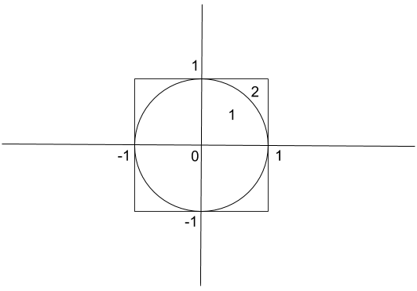
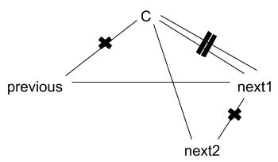
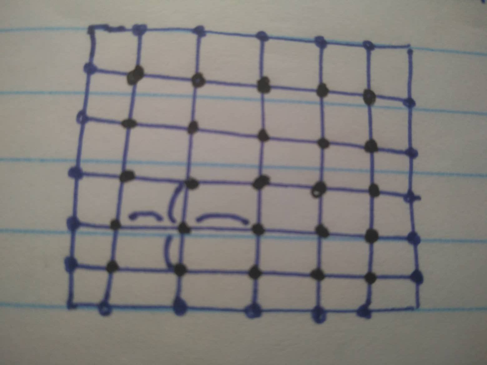
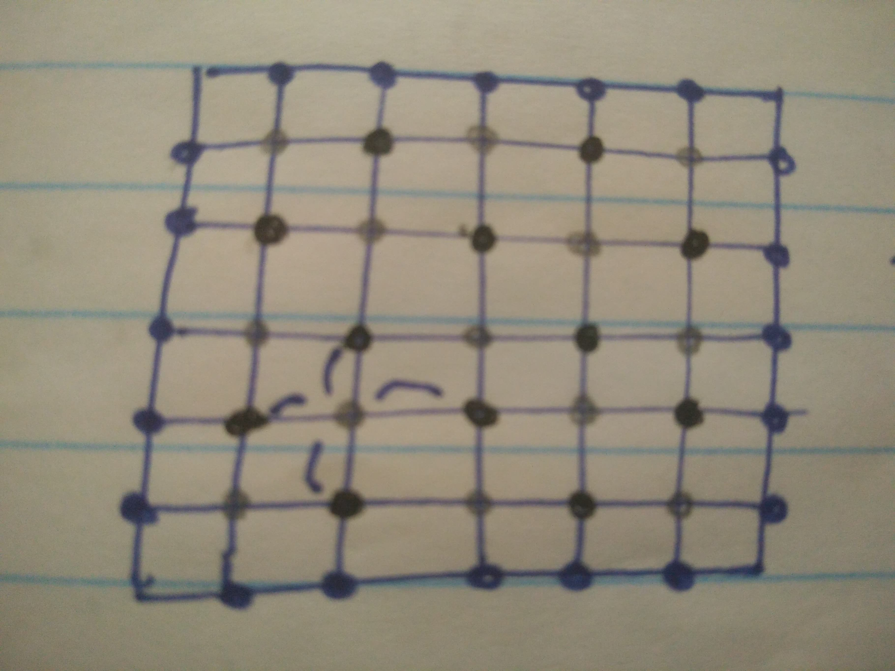

# Algoritmos Paralelos

Algoritmos que envolvem apenas o __Paradigma de Memória Distribuída__.

Os melhores algoritmos para paralelizar são os que apresentam complexidade: O($`N^3`$), O($`N!`$), ou seja, com grande complexidade (problemas NP-completos).

A resolução de problemas por métodos diretos tem complexidade O($`N`$) e os métodos iterativos tem complexidade O($`N^3`$).

| Complexidade | Nº de operações por elemento |
| :----------: | :--------------------------: |
| ...          | ...                          |
| O($`N!`$)    | $`(N-1)!`$                   |
| O($`N^3`$)   | $`N^2`$                      |
| O($`N^2`$)   | $`N`$                        |
| O($`NlogN`$) | $`logN`$                     |
| O($`N`$)     | $`1`$                        |
| ...          | ...                          |

$`Nº\ de\ operaões\ por\ elemento = \frac{complexidade}{nº\ de\ elementos}`$

São mais fáceis de paralelizar e de obter ganhos os algoritmos que são maus em termos sequenciais.

É muito mais dificil paralelizar algoritmos com estruturas irregulares do que com estruturas regulares. Convém passar estruturas irregulares para regulares. Considera-se uma estrutura irregular seja pelo uso de apontadores, seja pelos acessos irregulares aos dados.

## Algoritmo de aproximação ao valor de $`\pi`$

```math
(x,y) \\
0 \leq x \leq 1 \\
\sqrt{x^2 + y^2} \leq 1 \\
``` 
então:
1. está dentro do quarto de círculo
2. senão está fora

Quadrado é circunscrito ao círculo.

Quantos mais "tiros" tendencionalmente melhor será a aproximação ao $`\pi`$

Código em MATLAB/Octave:
```matlab
% this script uses random numbers to compute pi

n=input('Número de pontos > ');

in=0;       % number of points inside circle
fplot('sqrt(1-x^2)',[0,1]), hold on
for i=1:n
    x=rand; y=rand;
    plot(x,y,'k*'), hold on
    if (x^2+y^2 <= 1)
        in=in+1;
    end
end
(in/n)*4
hold off
```

## Caixeiro Viajante (TSP)

Algoritmo "no greedy" (Método de Monte Carlo)

Temos os pontos $`P_i(x_i,x_j),`$ $`i,j=1,...,n`$ e conhecemos as distâncias $`d(P_i,P_j)=\sqrt{(x_j-x_i)^2+(y_j-y_i)^2}`$

$`D(i,j) = d(P_i,P_j)`$ [a matriz D é simétrica]

$`D(i,j)`$: distância entre as "cidades" i e j

### Método de Monte Carlo (Metropolis):

começa com:

$`\sum{d(i,j)}`$

rota inicial aletória (O($`N!`$))

depois:

São feitas melhorias locais aleatoriamente até não se conseguir obter ganhos ao fim de x ciclos:



## Fenómeno de Marsaglia
```matlab
% MATLAB (OCTAVE) script marsaglia: ilustra o fenómeno de Marsaglia

% a partir de uma semente racional x(1) (nota: todos os números 
% representados no computador são racionais), este código produz uma
% sequência x(1),...,x(20), de números entre 0 e 1, tal que os pontos 
% (x(k),x(k+1)), k=1,...19, estão todos sobre duas rectas paralelas. 
% Isto mostra que existe uma forte correlação entre eles, pelo que este
% não é um bom gerador de números pseudo-aleatórios


n=20;                         % número de pontos
x(1)=rand;                    % semente (entre 0 e 1)

for i=1:n
    x(i+1)=rem(2*x(i),1);     % gerador
end
x'
% Usando plot(x) obtemos um gráfico de pontos (k,x(k)) e pode parecer que
% não há correlação entre os números x(k)...
subplot(2,1,1), plot(x,'o')

% Porém, o gráfico de pontos (x(k),x(k+1)) mostra que há uma forte
% correlação já que estes pontos estão sobre duas rectas paralelas...

a=x(1:n-1); b=x(2:n); 
subplot(2,1,2), plot(a,b,'+')               

% NOTA: para executar este código deve guardá-lo num ficheiro com a 
% extensão .m (por exemplo marsaglia.m) e, na linha de comandos, invocar o 
% nome sem extensão ( > marsaglia)
```

## Mersenne Twister
Gerador de números pseudo-aleatórios (PRNG) e é bastante usado. 

O seu nome deriva do facto de que o tamanho do seu período é escolhido para ser um primo de Mersenne.

## Simulated Annealing (SA)
Técnica probabilistica para aproximar o ótimo global de uma determinada função. Mais especificamente é uma meta heuristica para aproximar o ótimo global num grande espaço de procura para um problema de otimização. É uma técnica iterativa pelo que ao fim de cada iteração "o espaço por onde procura uma melhor solução que a atual" diminui.

Algoritmo:

Em cada iteração do algoritmo, um novo ponto é gerado aleatoriamente. A distância do novo ponto a partir do ponto atual, ou a extensão da pesquisa, é baseada em uma distribuição de probabilidade com uma escala proporcional à "temperatura". O algoritmo aceita todos os novos pontos que baixam o objetivo, mas também, com certa probabilidade, pontos que aumentam o objetivo. Ao aceitar pontos que aumentam o objetivo, o algoritmo evita ficar preso em mínimos locais nas primeiras iterações e é capaz de explorar globalmente as melhores soluções.

Caso do caixeiro viajante usando Monte Carlo com Simulated Annealing:

```matlab
function [Tdist,town]=traveling(D)
% function [Tdist,town]=traveling(x,y,D)
% uses simulated annealing to solve the Traveling Salesman Problem: given n
% towns and the distances between any two of them, finds the shortest route 
% that starts at one of the towns, goes once through everyone of the others 
% and returns to the first one

n=length(D);
% FIRST tentative route 
town=randperm(n);           % a random permutation of the first n integers 
Tdist=D(town(n),town(1));
for i=1:n-1                               % length of 
    Tdist=Tdist+D(town(i),town(i+1));     % initial route
end

T=1;     % initial temperature
i=0;
while i < 100           % stop if no changes for 100 iterations
    c=randi(n);         % randomly chooses a town (at position c in route)
    if c==1             % and swaps its position with the next one
        previous=n; next1=2; next2=3;
    elseif c==n-1
        previous=n-2; next1=n; next2=1;
    elseif c==n
        previous=n-1; next1=1; next2=2;
    else
        previous=c-1; next1=c+1; next2=c+2;
    end
    % delta=increment in length of route
    delta=D(town(previous),town(next1))+D(town(c),town(next2))-D(town(previous),town(c))-D(town(next1),town(next2)); 
    % accept or discard change to route 
    if delta<0 | (exp(-delta/T)>= rand) %if delta<0 | (T>0.001 & (exp(-delta/T)>= rand))?
        temp=town(c); town(c)=town(next1); town(next1)=temp; % swap order of town(c) and town(c+1) in route                 
        Tdist=Tdist+delta; 
        if delta~=0
            i=0;
        end
    else i=i+1;
    end
    T=0.999*T;
end
```

## BLAS (Basic Linear Algebra Subprograms)

Níveis:
- BLAS 1: (vetor x vetor)
  - dados : O($`N`$)
  - FLOPS : O($`N`$)
  - Ex: $`\sum_{i=1}^{n} x_i * y_i`$ ($`n`$ produtos + $`n-1`$ adições)
- BLAS 2: (matriz x vetor)
  - dados : O($`N^2`$)
  - FLOPS : O($`N^2`$) 
  - Ex: $`A . x`$ ou seja, para $`i=1:n`$, $`\sum_{j=1}^{n} A(i,j) * x_j`$ ($`n^2`$ produtos + $`n(n-1)`$ adições)
- BLAS 3: (matriz x matriz)
  - dados : O($`N^2`$)
  - FLOPS : O($`N^3`$)
  - Ex: $`A.B`$ ($`n^3`$ produtos + $`n^2(n-1)`$ adições) 

Os kernels em cada nível são divididos em (começam por):
- S : precisão simples
- D : precisão dupla
- C : precisão simples de números complexos
- Z : precisão dupla de números complexos

LAPACK (Linear Algebra PACKage) = LINPACK + EISPACK

### Kernel saxpy

Fórmula: $`y \leftarrow y + a.x`$

Ex:

$`
\begin{bmatrix}
    a_{11} & a_{12} & a_{13} \\[0.3em]
    a_{21} & a_{22} & a_{23} \\[0.3em]
    a_{31} & a_{32} & a_{33}
\end{bmatrix}
.
\begin{bmatrix}
    x_1 \\[0.3em]
    x_2 \\[0.3em]
    x_3
\end{bmatrix}
= \begin{bmatrix}
    a_{11}.x_1 + a_{12}.x_2 + a_{13}.x_3 \\[0.3em]
    a_{21}.x_1 + a_{22}.x_2 + a_{23}.x_3 \\[0.3em]
    a_{31}.x_1 + a_{32}.x_2 + a_{33}.x_3
\end{bmatrix}
\Rightarrow
x_1.
\begin{bmatrix}
    a_{11} \\[0.3em]
    a_{21} \\[0.3em]
    a_{31}
\end{bmatrix}
+ 
x_2 . 
\begin{bmatrix}
    a_{12} \\[0.3em]
    a_{22} \\[0.3em]
    a_{32}
\end{bmatrix}
+
x_3 .
\begin{bmatrix}
    a_{13} \\[0.3em]
    a_{23} \\[0.3em]
    a_{33}
\end{bmatrix}
`$

### Uso de blocos

$`
\left[
\begin{array}{cc|cc}
    a_{11} & a_{12} & a_{13} & a_{14} \\[0.3em]
    a_{21} & a_{22} & a_{23} & a_{24} \\[0.3em]
    \hline
    a_{31} & a_{32} & a_{33} & a_{34} \\[0.3em]
    a_{41} & a_{42} & a_{43} & a_{44}
\end{array}
\right]
.
\left[
\begin{array}{cc|cc}
    b_{11} & b_{12} & b_{13} & b_{14} \\[0.3em]
    b_{21} & b_{22} & b_{23} & b_{24} \\[0.3em]
    \hline
    b_{31} & b_{32} & b_{33} & b_{34} \\[0.3em]
    b_{41} & b_{42} & b_{43} & b_{44}
\end{array}
\right]
= \begin{bmatrix}
    C_{11} & C_{12} \\[0.3em]
    C_{21} & C_{22}
\end{bmatrix}
`$

$`
\begin{bmatrix}
    A_{11} & A_{12} \\[0.3em]
    A_{21} & A_{22} 
\end{bmatrix}
.
\begin{bmatrix}
    B_{11} & B_{12} \\[0.3em]
    B_{21} & B_{22} 
\end{bmatrix}
= \begin{bmatrix}
    C_{11} & C_{12} \\[0.3em]
    C_{21} & C_{22}
\end{bmatrix}
`$

$`
C_{11} = A_{11} . B_{11} + A_{12} . B_{21} \\
... \\
(NxN)\ com\ N = \frac{n}{p}\ em\ que\ n=ordem\ da\ matrix
`$

## Google Matrix

A Google matrix é uma matriz estocástica particular que é usada pelo algoritmo PageRank da Google. A matrix representa um grafo com arestas a representar os links entre páginas (websites). Esta matriz é uma matriz de adjacência esparsa. 

### PageRank

PageRank é um algoritmo usado pelo Google Search para rankear as páginas web nos resultados obtidos pelo motor de busca da Google.

O PageRank de forma a calcular uma estimativa do rank de (quão importante é) uma página, conta o número e a qualidade dos links para a página. O pressuposto subjacente é que sites mais importantes provavelmente receberão mais links de outros sites.

## Algoritmos "Matrix-free"

É um algoritmo para resolver um sistema linear de equações ou um problema de eigenvalue, que não armazena a matriz de coeficientes explicitamente, mas acede a matriz avaliando produtos vetoriais de matriz. Tais algoritmos podem ser preferíveis quando a matriz é tão grande que armazená-la e manipulá-la custaria muito tempo de memória e de computador, mesmo com o uso de métodos para matrizes esparsas.

Muitos algoritmos iterativos permitem uma implementação matrix-free entre eles:
 - Método de potência
 - Algoritmo Lanczos 
 - LOBPCG (Locally Optimal Block Preconditioned Conjugate Gradient Method)
 - Algoritmo de recorrência coordenada de Wiedemann 
 - Método do gradiente conjugado 

Soluções distribuídas têm sido também exploradas usando sistemas de software paralelos coarse-grain de modo a alcançar soluções homogéneas de sistemas lineares.

## Matriz Banda

$`a_{ij} = 0\ se\ |i-j|>k\ (k<<n)`$

Um caso particular é a matriz tridiagonal (k=1).

### Matriz Tridiagonal

Uma matriz tridiagonal é uma matriz banda que apenas não tem zeros na diagonal principal, na primeira diagonal abaixo e na primeiro diagonal acima da diagonal principal.

Ex:

$`
\begin{pmatrix}
    a_{11} & a_{12} & \cdots    & 0 \\
    a_{21} & a_{22} & \ddots    & \vdots \\
    \vdots & \ddots & \ddots    & a_{n-1,n}\\
    0      & \cdots & a_{n,n-1} & a_{nn} 
\end{pmatrix}
`$

## Algoritmo de Strassen/Volker Strassen

É um algoritmos para multiplicação de matrizes. É mais rápido que o algoritmo padrão para a multiplicação de matrizes e é util na prática para matrizes grandes, mas seria mais lento que os algoritmos mais rápidos conhecidos para matrizes extremamente grandes.

Complexidade assintótica: O($`N^{2.8074}`$)

## Representação de Matrizes

Seja:

$`T.x= \begin{bmatrix}
       d_1 & f_1    & 0   \\[0.5em]
       e_1 & \ddots & f_n \\[0.5em]
       0   & e_n    & d_n
        \end{bmatrix}
    . \begin{bmatrix}
       x_1 \\
       \vdots \\
       x_n          
     \end{bmatrix}
`$

Há duas representações possiveis:

- 1º:

Seja:

$`T(i,j),i,j=1,...,n`$

$`y=T.x`$

Então:

$`y(i)=\sum_{j=i}^{n} T(i,j) . x_j,\ para\ cada\ i=1,...,n`$

Mas $`T(i,j)\neq0\ só\ se\ |i-j|\leq1`$

Complexidade: $`O(N^2)`$

- 2º: Representar as diagonais diferentes de 0, em que cada diagonal é um array:

$`y_1 \leftarrow d_1 . x_1 + f_1 . x_2`$

$`y_2 \leftarrow e_1 . x_1 + d_2 . x_2 + f_2 . x_3`$

$`\vdots`$

$`y_i=e_{i-1} . x_{i-1} + d_i . x_i + f_i . x_{i+1}\ para\ i=2,...,n-1`$

$`\vdots`$

$`y_n=e_{n-1} . x_{n-1} + d_n . x_n`$

Com esta abordagem poupa-se em espaço de memória e em número de operações aritméticas realizadas.

Complexidade: $`O(N)`$

## Matriz dominante

Uma matriz é dominantes se e só se (Condição suficiente), para cada linha da matriz:

$`|a{ii}|>\sum_{j=1 j;\neq i}^{n} |a_{ij}|`$

## Sistemas de Equações Lineares

$`A x = b`$

### Métodos Diretos

Usados para matrizes densas, principalmente.

Transformam A.

Numa matriz esparsa tem um grande problema: fill-in (colocação de valores diferentes de zero em locais em que o seu valor era zero).

#### Método de Eliminação de Gauss

$`Ax=b`$ --- operações de equivalência (redução) --> $`Ux=b'`$ (U = matriz triangular superior) => depois efetuar substituições (back substitution - substituição inversa), cada substituição pode ser expressa numa saxpy (BLAS 1)

##### Pivotagem Parcial

O aparecimento de pivots nulos ou muito pequenos no método de eliminação de gauss tem efeitos catastróficos a nível numérico, levando em imensos casos a elevada instabilidade. Esta instabilidade pode (na maior parte dos casos) ser eliminada escolhendo, em cada passo, para  pivot o maior elemento. Para tal, depois de identificar tal elemento, basta efectuar uma simples troca de linhas e/ou colunas. Esta técnica chamasse pivotagem.

A pivotagem parcial consiste em, no passo k, escolher o pivot entre os elementos da coluna k que se encontram abaixo da diagonal.

 Há também pivotagem total que garante que os erros são ainda menores que na Pivotagem Parcial.

### Métodos Iterativos

Usado para matrizes grandes e esparsas, principalmente.

Não transformam A, baseiam-se em matrizes por vetores (BLAS 2), $`A . v`$

Problema: Convergência. Converge?

Nos métodos iterativos a solução é um limite que provavelmente nunca se vai atingir:

$`solução\ "exata"=\lim_{k->+\infty} x_k `$

como funcionam os métodos iterativos:

$`x^{(0)} -f-> x^{(1)} -f-> x^{(2)} -...-> x^{(k)} -...-> Converge?`$

#### Método Jacobi

Função:

$`x_i^{k+1}=\frac{1}{a_{i,i}}(b_i-\sum_{j\neq i} a_{i,j}.x_j^k)`$

Seja:

$`Ax=b
\iff
\begin{bmatrix}
       a_{11} & a_{12} & \dots & a_{1n} \\[0.5em]
       a_{21} & a_{22} & \dots & a_{2n} \\[0.5em]
       \vdots & \vdots & \ddots& \vdots \\[0.5em]
       a_{i1} & a_{i2} & \dots & a_{in} \\[0.5em]
       \vdots & \vdots & \ddots& \vdots \\[0.5em]
       a_{n1} & e_{n2} & \dots & a_{nn}
        \end{bmatrix}
    . \begin{bmatrix}
       x_1 \\[0.5em]
       x_2 \\[0.5em]
       \vdots \\[0.5em]
       x_i \\[0.5em]
       \vdots \\[0.5em]
       x_n          
     \end{bmatrix}
    = \begin{bmatrix}
       b_1 \\[0.5em]
       b_2 \\[0.5em]
       \vdots \\[0.5em]
       b_i \\[0.5em]
       \vdots \\[0.5em]
       b_n          
     \end{bmatrix} 
`$ 

na i-ézima equação:

$`a_{i1}.x_1+a_{i2}.x_2+\dots+a_{i,i-1}.x_{i-1}+a_{ii}.x_i + a_{i,i+1}.x_{i+1}+\dots+a_{in}.x_n=b_i
\iff
a_{ii}.x_i=b_i-\sum_{j=1,j\neq i}^n a_{ij}.x_j
\iff
x_i = \frac{1}{a_{ii}}(b_i-\sum_{j=1,j\neq i}^n a_{ij}.x_j)
`$

A representação de todas as soluções é equivalente à representação inicial.

1º iteração: $`x_1^{(0)}\ x_2^{(0)}\ \dots\ x_n^{(0)}`$

2º iteração: $`x_1^{(1)}\ x_2^{(1)}\ \dots\ x_n^{(1)}`$

$`\vdots`$

Converge?

Ex: Dados uma matriz A ($`nxn`$) e vetores b (termos independentes) e x (aproximação inicial), escrever um código que calcula aproximações $`x^{(1)},x^{(2)},\dots,x^{(k+1)}`$ até $`||x^{(k+1)}-x^{(k)}||<tol`$ (tolerância fixada)

```matlab
function [x, iter]=Jacobi(A,b,tol,kmax)
%      Método iterativo de Jacobi
%      [x, iter]=Jacobi(A,b,tol,kmax) determina uma aproximação para
%      a solução do sistema Ax=b usando o método iterativo de
%      Jacobi tomando como aproximação inicial o vector nulo
%
%INPUTS:   A - matriz do sistema
%          b - vector coluna com n componentes
%          tol - tolerância para o erro
%          kmax - número máximo de iterações
%
%OUTPUTS:  x - solução (vector coluna)
%          iter - número de iterações


% Com A=D+L+U, D diagonal e L e U estritamente triangulares, inferior e
% superior respectivamente, temos a matriz de iteração de Jacobi
% BJ=-inv(D)*(L+U); o método converge SSE o raio espectral de BJ < 1.
% Para mais detalhes consulte por exemplo o livro do Prof. Heitor Pina,
% pag.343.


n=length(b);
x=zeros(n,1);   % aproximação inicial (vector nulo)
erro=tol+1;     % aqui qualquer valor maior do que tol serve
iter=0;         % inicializa um contador de iterações

while erro>tol & iter < kmax
    y=x;        % armazena os valores da iteraçao anterior
    for i=1:n
        h(i)=(b(i)-dot(A(i,:),y))/A(i,i); % implementação da fórmula
        x(i)=x(i)+h(i);                   % 8.2.4 no livro referido
    end
    erro=norm(h,inf);
    iter=iter+1;
end

if erro<=tol
    disp(['Atingiu-se a precisão desejada em ',num2str(iter-1),' iterações']);
else
    disp(['O método diverge ou converge mas kmax é insuficiente para permitir alcançar a precisão desejada']);
end
```

Neste caso:

$`||x^{(k+1)}-x^{(k)}||_\infty=max_{i\leq i \leq n}|x_i^{(k+1)}-x_i^{(k)}|`$

e

$`x_i = \frac{1}{a_{ii}}(b_i-\sum_{j=1,j\neq i}^n a_{ij}.x_j)
= x_i^{(k)} + \frac{1}{a_{ii}}(b_i-\sum_{j=1}^n a_{ij}.x_j)
`$

sendo que: $`h(i)=\frac{1}{a_{ii}}(b_i-\sum_{j=1}^n a_{ij}.x_j)`$

##### Convergência

Caso a matriz seja diagonal dominante (o módulo da diagonal é maior que a soma dos elementos em módulo da linha, ou seja, $`para\ todo\ i=1,...,n: |a_{ii}|>\sum_{j\neq i} |a_{ij}|`$) o método converge.

Para $`k\rightarrow\infty`$, a sequência $`\{x^k\}`$ converge para a solução se $`||E||<1`$

Por forma a calcular $`E`$ (matriz de iteração):

$`Ax=b
\iff
(L+D+U)x=b
\iff
Dx=-(L+U)x+b
x=-D^{-1}(L+U)x+D^{-1}b
\iff
x=Ex+f
`$

ou seja:

$`E=-D^{-1}(L+U)`$

e

$`f=D^{-1}b`$

Já para calcular o erro:

Seja:

Vetor solução: $`x̂`$

Vetor erro: $`e^k`$

$`x^k = e^k + x̂`$

$`x̂=Ex̂+f`$ como já visto anteriormente

Então:

$`x^{(k+1)}=Ex^k+f
\iff
e^{(k+1)}+x̂=E(e^k+x̂)+f
= Ex̂+f+Ee^k
\iff
e^{(k+1)}=Ee^k
`$

Sendo assim, com $`x^{(0)}`$ e $`e^{(0)}`$ inicialmente:

$`x^{(1)}=Ex^{(0)}+f\ \\ e^{(1)}=Ee^{(0)}`$

$`\rightarrow`$

$`x^{(2)}=Ex^{(1)}+f\ \\ e^{(1)}=Ee^{(1)}=E^2e^{(0)}`$

$`\vdots`$

$`e^k=E^ke^{(0)}`$

Portanto, de forma a reduzir o erro e de forma a convergir, $`E`$ deve tender para 0.

#### Método Gauss-Seidel

$`x_i^{(k+1)}= \frac{b_i - \sum_{j=1}^{i-1} a_{ij} x_j^{(k+1)} - \sum_{j=i+1}^n a_{ij} x_j^{(k)})}{a_{ii}}`$

$`Ax = b \rightarrow (L+D+U)x = b \rightarrow (L+D)x = b - Ux`$

Logo:

$`E = -(L+D)^{-1}*U \\
f = (L+D)^{-1}*b 
`$

Tendencialmente $`||E||_{Jacobi} > ||E||_{Gauss-Seidel}`$ logo o método Gauss-Seidel converge tendencialmente mais rapidamente que o método de Jacobi.

## Equação de Poison

$`\frac{\partial^2u}{\partial x^2}+\frac{\partial^2u}{\partial y^2}=0`$

Objetivo: Descobrir $`u(x,y)`$, ou seja, temperatura no estado de equilibrio ("steady state" temperature). Não há variação no tempo.

### Discretização

Passagem de um domínio contínuo para uma malha de pontos discreta. Cada ponto da malha dá origem a uma equação linear. Após aplicar a malha são feitas aproximações em cada ponto consoante o valor do ponto e da zona em redor do mesmo (stencil). O número de incógnitas em cada ponto dependem da vizinhança considerada (stencil).

Nesta descretização do problema, há erros de truncatura, sendo que este erro depende do "passo" entre pontos (ou seja, de forma a reduzir os erros de truncatura aumenta-se o número de pontos da malha).

A malha pode ser representada por uma matriz esparsa em que cada ponto é representado por uma linha.

Os coeficientes do stencil tem como base a Fórmula de Taylor.

Aplica-se a equação de Poison a todos os pontos da malha de discretização.

### Diferença Finita

Troca das derivadas parciais por stencils (aproximação). Visto ser um aproximação, apresenta um erro de truncatura.

$`f'(x) = \lim_{h \to 0^+} \frac{f(x+h)-f(x)}{h}`$ pode ser aproximado por:

$`f'(x) = \frac{f(x+h)-f(x)}{h} + O(h)`$ sendo $`O(h)`$ o erro de truncatura.

A aproximação anterior é pior que a seguinte:

$`f'(x) = \frac{f(x+\frac{h}{2})-f(x-\frac{h}{2})}{h} + O(h^2) = \frac{f(x+h)-f(x-h)}{2h} + O(h^2)`$
 
visto que o erro de truncatura é menor neste caso.

### Equação de Poison aplicando Diferenças Finitas

$`\frac{\partial^2u}{\partial x^2}+\frac{\partial^2u}{\partial y^2}=0 \Leftrightarrow
\frac{u(x+h,y) - 2u(x,y) + u(x-h,y)}{h^2} + \frac{u(x,y+k) - 2u(x,y) + u(x,y-k)}{k^2} = 0`$

### Mais concretamente (discretização do problema)



- A azul os pontos que conheço o valor (pontos de fronteira, valores de fronteira - boundering values)
- A preto os pontos nos quais não conheço o valor e que quero descobrir, ou seja, que serão calculados

$`Au=b`$

Cada u interior é a média aritmética dos 4 pontos à volta, ou seja, Five-point stencil.

$`\frac{\partial^2u}{\partial x^2}+\frac{\partial^2u}{\partial y^2}=0 \Leftrightarrow
\frac{u(x+h,y) - 2u(x,y) + u(x-h,y)}{h^2} + \frac{u(x,y+h) - 2u(x,y) + u(x,y-h)}{h^2} = 0 \Leftrightarrow
4u(x,y) = u(x,y-h) + u(x-h,y) + u(x+h,y) + u(x,y+h) \Rightarrow
u(i,j) = \frac{u(i-1,j) + u(i,j-1) + u(i,j+1) + u(i+1,j)}{4}`$

#### Critério de paragem usado nos algoritmos iterativos

$`||u^{(k+1)}-u^{(k)}|| \leq TOL`$

#### Custo de cada iteração

$`(N-2)^2 * (3 (adições) + 1 (divisão))`$ FLOPS

sendo $`N`$ a ordem da malha ("matriz")

### Estratégia Red-Black

Esta estratégia apenas pode ser aplicada se for usado o método iterativo Gauss-Seidel. Para o Jacobi todos os pontos podiam ser atualizados ao mesmo tempo, visto não haver dependências de dados, logo não seria necessário esta estratégia.



Há duas atualizações (passagens pela malha). Por exemplo: a 1º passagem pelos pontos cinzas e a segunda pelo pontos pretos, ou vice versa.

### Conclusões

Quanto maior o N:
- maior é o custo de cada iteração
- queremos mais precisão (caso $`TOL = \frac{1}{N^2}`$)
- a convergência é mais lenta

Logo maior é o peso computacional (mais tempo demora a ser calculado).