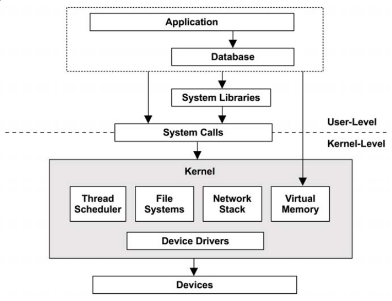

# Engenharia de Sistemas de Computação

TODO: LER LIVRO: Systems Performance - Enterprise and the Cloud, Capítulos 1,2,3,4 e 7

TODO: LER apontamentos da aula

## Chapter 1 - Introdução

### Systems Performance

Systems performance é o estudo de um sistema inteiro, incluíndo todos os componentes físicos e toda a stack de software. Qualquer data path, software ou hardware é incluído, visto que pode afetar a performance. Para sistemas distribuídos, um diagrama do ambiente mostrando os data path, irá ajudar a entender as relações entre componentes e a garantir que não se negligencia-se áreas inteiras.

Generic System software stack num único servidor, incluíndo o kernel do OS (Sistema Operativo):

#### Entire Stack

Em performance de sistemas quando se refere *entire stack* refere-se a tudo, desde o ambiente aplicacional, bem como as system libraries e o kernel.

### Atividades

Ordem ideal de execução das atividades:
1. Definir objetivos de desempenho e modelagem de desempenho
2. Caracterização de desempenho de software protótipo ou hardware
3. Análise de desempenho do código em desenvolvimento, pré-integration
4. Realizar testes de não regressão de compilações de software, pré- ou post-release
5. Benchmarking/benchmarketing para software releases
6. Teste de prova de conceito no ambiente destino
7. Otimização de configuração para deployment de produção
8. Monitorização de production software em execução
9. Análise de desempenho de problemas

Os passos de 1 a 5 fazem parte do desenvolvimento tradicional de produtos de software. O produto é então lançado, seguido por testes de prova de conceito no ambiente do cliente, ou deployment e configuração. Se um problema for encontrado no ambiente do cliente (passos de 6 a 9), isso significa que o problema não foi detectado ou corrigido durante os estágios de desenvolvimento.

Performance engineering deve idealmente começar antes que o hardware seja escolhido ou o software seja escrito. Esse pode ser o primeiro passo, envolvendo o estabelecimento de objetivos e a criação de um modelo de desempenho. Geralmente, os produtos são desenvolvidos sem essa etapa, adiando o trabalho de performance engineering para mais tarde, quando surge um problema. Com cada passo do processo de desenvolvimento, no entanto, pode se tornar progressivamente mais difícil corrigir problemas de desempenho, devido às decisões de arquitetura tomadas anteriormente.

O termo *capacity planning* pode referir-se a várias atividades anteriores. Durante o projeto, inclui o estudo da pegada (footprint) de recursos do software em desenvolvimento, para ver como o design pode atender às necessidades escolhidas. Após o deployment, inclui a monitorização do uso de recursos para prever problemas antes que eles ocorram.

### Performance é desafiante

Systems Perfomance Engineering é uma área desafiante por várias razões, incluíndo o facto de que é subjetivo, é complexo e pode envolver múltiplos problemas.

#### Performance é subjetiva

Com problemas de desempenho, pode não estar claro se há um problema para começar e, em caso afirmativo, quando ele foi corrigido. O que pode ser considerado um "mau" desempenho para um utilizador e, portanto, um problema, pode ser considerado "bom" desempenho para outro.

Exemplo: 

`The average disk I/O response time is 1 ms.`

Enquanto o tempo de resposta, ou latência, são das melhores métricas disponíveis, a interpretação desta informação exemplo é difícil. O facto de uma determinada métrica ser "boa" ou "má" pode depender das expectativas de desempenho dos desenvolvedores e dos utilizadores finais.

A subjetividade pode ser objetivada definindo metas claras, como ter uma marca a atingir para o tempo de resposta médio ou exigir que uma percentagem de solicitações caia dentro de um determinado intervalo de latência.

#### Os sistema são complexos

Além da subjetividade, o desempenho pode ser uma disciplina desafiadora devido à complexidade dos sistemas e à falta de um ponto de partida claro para efetuar a análise. Às vezes começamos com um palpite, como culpar a network, e o analista de desempenho precisa de descobrir se essa é a direção certa.

Os problemas de desempenho também podem ter origem em interações complexas entre subsistemas que funcionam bem quando analisados isoladamente. Isto pode ocorrer devido a uma falha em cascata, quando um componente falha e causa problemas de desempenho em outros. Para entender o problema resultante, deve-se descobrir as relacões entre os componentes e entender como eles contribuem.

Bottlenecks também podem ser complexos e estarem relacionados de maneiras inesperadas. A resolução de um pode simplesmente mover o bottleneck para outro lugar do sistema, com o desempenho geral a não melhorar tanto quanto se esperava.

Além da complexidade do sistema, os problemas de desempenho podem ser causados pela característica de complexidade da carga de trabalho de produção. Nesses casos, eles podem nunca ser reproduzíveis num ambiente de laboratório ou apenas de forma intermitente.

Resolver problemas complexos de desempenho geralmente requer uma abordagem holística. Todo o sistema - tanto a parte interna quanto a parte externa - pode ser preciso investigar. Isso requer uma ampla gama de habilidades, que normalmente não são encontradas numa pessoa, tornando a engenharia de desempenho uma área de trabalho variada e intelectualmente desafiadora.

#### Pode haver várias problemas de performance

Encontrar um problema de desempenho geralmente não é o problema, em softwares complexos, frequentemente há muitos. Normalmente, haverá vários problemas de desempenho conhecidos, mas ainda não corrigidos, mesmo em softwares desenvolvidos que são considerados de alto desempenho. Isso representa outra dificuldade ao analisar o desempenho: a tarefa real não é encontrar um problema, é identificar o problema ou os problemas mais importantes.

Para fazer isso, o analista de desempenho deve quantificar a magnitude dos problemas. Alguns problemas de desempenho podem não se aplicar à carga de trabalho ou podem ser aplicados apenas num grau muito pequeno. Idealmente, não será apenas quantificado os problemas, mas também estimado o speedup caso cada um deles seja corrigido.

Uma métrica adequada para quantificação de desempenho, quando disponível, é a latência.

### Latência

A latência é a medição do tempo gasto em espera que uma operação conclua.

Embora a latência seja uma métrica útil, nem sempre está disponível quando e onde é necessário. Algumas áreas do sistema fornecem apenas latência média; algumas não fornecem métricas de latência. Com o dynamic tracing, a latência pode ser medida a partir de pontos arbitrários fornecendo dados que mostram a distribuição completa da latência.

### Dynamic Tracing

O dynamic tracing permite que todo o software seja instrumentalizado, live e em produção. Permite que estatísticas personalizadas de desempenho sejam criadas a partir de qualquer software em execução, fornecendo uma observação muito além do que as estatísticas base fornecem. Questões que anteriormente eram impossíveis de resolver devido à falta de observabilidade podem agora ser resolvidas. Questões que antes eram possíveis de resolver, mas proibitivamente difíceis, agora são mais fáceis.

Foi disponibilizado pela primeira vez como uma ferramenta pronta para produção com o DTrace, que fornece muitos outros recursos, incluindo a sua própria linguagem de programação, D.

Antes do DTrace, o rastreamento do sistema era executado usando *static probes*: um pequeno conjunto de pontos de instrumentalização colocados no kernel e em outro software. A sua visibilidade era limitada e seu uso consumia muito tempo.

O DTrace fornece rastreamento estático e dinâmico de software ao nível do utilizador e do kernel e pode fornecer dados em tempo real.

## Chapter 2 - Metodologia