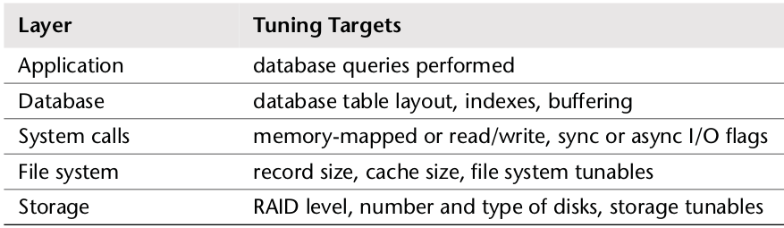

# Engenharia de Sistemas de Computação

TODO: LER LIVRO: Systems Performance - Enterprise and the Cloud, Capítulos 1,2,3,4 e 7

C1: 14

C2: 69

C3: 30

C4: 38

C7: 57

TODO: LER apontamentos da aula

## Chapter 1 - Introdução

### Systems Performance

Systems performance é o estudo de um sistema inteiro, incluíndo todos os componentes físicos e toda a stack de software. Qualquer data path, software ou hardware é incluído, visto que pode afetar a performance. Para sistemas distribuídos, um diagrama do ambiente mostrando os data path, irá ajudar a entender as relações entre componentes e a garantir que não se negligencia-se áreas inteiras.

Generic System software stack num único servidor, incluíndo o kernel do OS (Sistema Operativo):

#### Entire Stack

Em performance de sistemas quando se refere *entire stack* refere-se a tudo, desde o ambiente aplicacional, bem como as system libraries e o kernel.

### Atividades

Ordem ideal de execução das atividades:
1. Definir objetivos de desempenho e modelagem de desempenho
2. Caracterização de desempenho de software protótipo ou hardware
3. Análise de desempenho do código em desenvolvimento, pré-integration
4. Realizar testes de não regressão de compilações de software, pré- ou post-release
5. Benchmarking/benchmarketing para software releases
6. Teste de prova de conceito no ambiente destino
7. Otimização de configuração para deployment de produção
8. Monitorização de production software em execução
9. Análise de desempenho de problemas

Os passos de 1 a 5 fazem parte do desenvolvimento tradicional de produtos de software. O produto é então lançado, seguido por testes de prova de conceito no ambiente do cliente, ou deployment e configuração. Se um problema for encontrado no ambiente do cliente (passos de 6 a 9), isso significa que o problema não foi detectado ou corrigido durante os estágios de desenvolvimento.

Performance engineering deve idealmente começar antes que o hardware seja escolhido ou o software seja escrito. Esse pode ser o primeiro passo, envolvendo o estabelecimento de objetivos e a criação de um modelo de desempenho. Geralmente, os produtos são desenvolvidos sem essa etapa, adiando o trabalho de performance engineering para mais tarde, quando surge um problema. Com cada passo do processo de desenvolvimento, no entanto, pode se tornar progressivamente mais difícil corrigir problemas de desempenho, devido às decisões de arquitetura tomadas anteriormente.

O termo *capacity planning* pode referir-se a várias atividades anteriores. Durante o projeto, inclui o estudo da pegada (footprint) de recursos do software em desenvolvimento, para ver como o design pode atender às necessidades escolhidas. Após o deployment, inclui a monitorização do uso de recursos para prever problemas antes que eles ocorram.

### Performance é desafiante

Systems Perfomance Engineering é uma área desafiante por várias razões, incluíndo o facto de que é subjetivo, é complexo e pode envolver múltiplos problemas.

#### Performance é subjetiva

Com problemas de desempenho, pode não estar claro se há um problema para começar e, em caso afirmativo, quando ele foi corrigido. O que pode ser considerado um "mau" desempenho para um utilizador e, portanto, um problema, pode ser considerado "bom" desempenho para outro.

Exemplo: 

`The average disk I/O response time is 1 ms.`

Enquanto o tempo de resposta, ou latência, são das melhores métricas disponíveis, a interpretação desta informação exemplo é difícil. O facto de uma determinada métrica ser "boa" ou "má" pode depender das expectativas de desempenho dos desenvolvedores e dos utilizadores finais.

A subjetividade pode ser objetivada definindo metas claras, como ter uma marca a atingir para o tempo de resposta médio ou exigir que uma percentagem de solicitações caia dentro de um determinado intervalo de latência.

#### Os sistema são complexos

Além da subjetividade, o desempenho pode ser uma disciplina desafiadora devido à complexidade dos sistemas e à falta de um ponto de partida claro para efetuar a análise. Às vezes começamos com um palpite, como culpar a network, e o analista de desempenho precisa de descobrir se essa é a direção certa.

Os problemas de desempenho também podem ter origem em interações complexas entre subsistemas que funcionam bem quando analisados isoladamente. Isto pode ocorrer devido a uma falha em cascata, quando um componente falha e causa problemas de desempenho em outros. Para entender o problema resultante, deve-se descobrir as relacões entre os componentes e entender como eles contribuem.

Bottlenecks também podem ser complexos e estarem relacionados de maneiras inesperadas. A resolução de um pode simplesmente mover o bottleneck para outro lugar do sistema, com o desempenho geral a não melhorar tanto quanto se esperava.

Além da complexidade do sistema, os problemas de desempenho podem ser causados pela característica de complexidade da carga de trabalho de produção. Nesses casos, eles podem nunca ser reproduzíveis num ambiente de laboratório ou apenas de forma intermitente.

Resolver problemas complexos de desempenho geralmente requer uma abordagem holística. Todo o sistema - tanto a parte interna quanto a parte externa - pode ser preciso investigar. Isso requer uma ampla gama de habilidades, que normalmente não são encontradas numa pessoa, tornando a engenharia de desempenho uma área de trabalho variada e intelectualmente desafiadora.

#### Pode haver várias problemas de performance

Encontrar um problema de desempenho geralmente não é o problema, em softwares complexos, frequentemente há muitos. Normalmente, haverá vários problemas de desempenho conhecidos, mas ainda não corrigidos, mesmo em softwares desenvolvidos que são considerados de alto desempenho. Isso representa outra dificuldade ao analisar o desempenho: a tarefa real não é encontrar um problema, é identificar o problema ou os problemas mais importantes.

Para fazer isso, o analista de desempenho deve quantificar a magnitude dos problemas. Alguns problemas de desempenho podem não se aplicar à carga de trabalho ou podem ser aplicados apenas num grau muito pequeno. Idealmente, não será apenas quantificado os problemas, mas também estimado o speedup caso cada um deles seja corrigido.

Uma métrica adequada para quantificação de desempenho, quando disponível, é a latência.

### Latência

A latência é a medição do tempo gasto em espera que uma operação conclua.

Embora a latência seja uma métrica útil, nem sempre está disponível quando e onde é necessário. Algumas áreas do sistema fornecem apenas latência média; algumas não fornecem métricas de latência. Com o dynamic tracing, a latência pode ser medida a partir de pontos arbitrários fornecendo dados que mostram a distribuição completa da latência.

### Dynamic Tracing

O dynamic tracing permite que todo o software seja instrumentalizado, live e em produção. Permite que estatísticas personalizadas de desempenho sejam criadas a partir de qualquer software em execução, fornecendo uma observação muito além do que as estatísticas base fornecem. Questões que anteriormente eram impossíveis de resolver devido à falta de observabilidade podem agora ser resolvidas. Questões que antes eram possíveis de resolver, mas proibitivamente difíceis, agora são mais fáceis.

Foi disponibilizado pela primeira vez como uma ferramenta pronta para produção com o DTrace, que fornece muitos outros recursos, incluindo a sua própria linguagem de programação, D.

Antes do DTrace, o rastreamento do sistema era executado usando *static probes*: um pequeno conjunto de pontos de instrumentalização colocados no kernel e em outro software. A sua visibilidade era limitada e seu uso consumia muito tempo.

O DTrace fornece rastreamento estático e dinâmico de software ao nível do utilizador e do kernel e pode fornecer dados em tempo real.

## Chapter 2 - Metodologia

### Terminologia

- __IOPS__: operações Input/Output por segundo é uma medida de rácio de operações de transferência de dados. Para disco, IOPS refere-se às leituras e escritas por segundo
- __Throughput__: rácio de trabalho realizado. Especialmente nas comunicações, o termo é usado para referir *data rate* (bytes por segundo ou bits por segundo). Noutros contextos, throughput pode referir-se a *operation rate* (operações por segundo ou transações por segundo).
- __Response Time__ (tempo de resposta): o tempo que uma operação demora a concluir. Isto inclui qualquer tempo gasto em espera, o tempo gasto a realizar o serviço (*service time*) e inclui também o tempo de transferência do resultado.
- __Latency__ (latência): latência é a medida do tempo que uma operação gasta à espera por um serviço. Em alguns contextos, pode referir-se ao tempo total da operação, sendo neste caso, equivalente ao response time.
- __Utilization__ (utilização):Para recursos que servem pedidos, utilização é a medida do quão ocupado está o recurso, baseado em quanto do tempo num dado intervalo o recurso está ativamente a realizar trabalho. Para recursos que providenciam espaço de armazenamento, utilização pode referir-se à capacidade utilizada.
- __Saturation__ (saturação): é o grau no qual o recurso tem trabalho em fila que não consegue prestar serviço.
- __Bottleneck__: um bottleneck é um recurso que limita a performance do sistema. Identificar e remover bottlenecks sistemáticos é a atividade principal de systems performance.
- __Workload__: é o input do sistema ou a carga aplicada. Para uma base de dados, o workload consiste nos comandos e queries enviados pelo cliente para a base de dados.
- __Cache__: um espaço de armazenamento rápido que pode duplicar ou realizar buffer dum tamanho limitado de dados, para evitar comunicar diretamente com uma camada de armazenamento mais lenta, melhorando assim a performance.

### Modelos

#### System under test (Sistema em teste)

Performance de um system under test (SUT):

É importante ter o cuidado de que perturbações (interferência) pode afetar resultados, incluíndo aqueles causados pela atividade scheduled do sistema, outros utilizadores do sistema e outros workloads. A origem das perturbações pode não ser clara, e um estudo cuidado da performance do sistema é necessária para determiná-la. Isto pode ser particularmente difícil em alguns ambientes em cloud, onde outras atividades a correr no sistema host físico não são observáveis de um guest SUT.

Outra dificuldade com os ambientes modernos é que eles podem ser compostos de vários componentes distribuídos necessários para atender a carga de trabalho de entrada.

O simples ato de mapear o ambiente pode ajudar a revelar fontes de perturbações anteriormente negligenciadas. O ambiente também pode ser modelado como uma rede de sistemas de filas, para estudo analítico.

#### Queueing System (Sistema de filas)

Alguns componentes e recursos podem ser moduleados como um sistema de filas.

### Conceitos

#### Latência

Para alguns ambientes, a latência é o único foco de performance. Para outros, é uma das áreas principais para análise, juntamente com o throughput.

Como a latência é uma métrica baseada em tempo, vários cálculos são possíveis. Os problemas de desempenho podem ser quantificados usando latência e, em seguida, classificados porque são expressos usando as mesmas unidades (tempo). O speedup previsto também pode ser calculado considerando quando a latência pode ser reduzida ou removida. Nenhum destes pode ser calculado com precisão usando uma métrica de IOPS, por exemplo.

#### Escalas de tempo (Time Scales)

Embora o tempo possa ser comparado numericamente, também ajuda a ter um instinto sobre o tempo e as expectativas de latência de diferentes fontes. Os componentes do sistema operam em escalas de tempo muito diferentes (ordens de grandeza), na medida em que pode ser difícil entender o tamanho dessas diferenças.

#### Trade-offs

O trade-off "good/fast/cheap pick two":

Muitos projetos escolhem on-time e inexpensive, deixando a performance para ser corrigido mais tarde. Essa escolha pode se tornar problemática quando as decisões anteriores inibem a melhoria do desempenho.

Um trade-off comum no ajuste de desempenho é entre o CPU e a memória, já que a memória pode ser usada para armazenar os resultados em cache, reduzindo o uso do CPU. Em sistemas modernos com abundância de CPU, pode funcionar de outra maneira: o CPU pode ser utilizado para compactar dados de modo a reduzir o uso de memória.

Parâmetros ajustáveis geralmente vêm com trade-offs.

#### Tuning Efforts

O ajuste de desempenho é mais eficaz quando feito mais próximo de onde o trabalho é realizado. Para workloads orientadas por aplicações, isso significa dentro da própria aplicação.

Exemplos de otimizações a realizar em cada camada:

Há outro motivo para encontrar grandes ganhos de desempenho ao nível da aplicação. Muitos dos ambientes atuais são voltados para o deployment rápido de recursos e de funcionalidades. Assim, o desenvolvimento e o teste de aplicações tendem a se concentrar na exatidão, deixando pouco ou nenhum tempo para a medição ou otimização do desempenho antes do deployement de produção. Essas atividades são realizadas mais tarde, quando o desempenho já é um problema.

Embora a aplicação possa ser o nível mais eficaz para realizar ajustamentos, não é necessariamente o nível mais eficaz para basear a observação. As consultas lentas podem ser melhor compreendidas a partir do tempo gasto no CPU ou no sistema de arquivos e do I/O de disco que eles executam. Estes são observáveis a partir de ferramentas do sistema operativo.

Em muitos ambientes (especialmente em cloud computing), o nível aplicacional está em constante desenvolvimento. Grandes ganhos de desempenho, incluindo correções para regressões, são frequentemente encontradas conforme o código da aplicação é alterado. Nesses ambientes, otimizar e observar ao nível do sistema operativo podem ser facilmente ignorados. A análise de desempenho do sistema operativo pode identificar problemas ao nível aplicacional, para além de problemas ao nível do sistema operativo, por vezes, com mais facilidade do que analisar apenas a aplicação.

#### Nível de adequação (Appropriateness)

Organizações e ambientes diferentes têm requisitos diferentes para desempenho. Pode ter se juntado a uma organização onde é normal analisar muito mais do que está habituado. Ou pode achar que o que considera análise básica é considerado avançado e nunca foi realizado antes.

Isto não significa necessariamente que algumas organizações estão fazendo bem e outras mal, depende do retorno do investimento (ROI) para o conhecimento do desempenho. 

#### Recomendações Point-in-Time

As características de desempenho dos ambientes mudam com o tempo, devido à adição de mais utilizadores, hardware mais novo e software ou firmware atualizado.

As recomendações de desempenho, especialmente os valores dos parâmetros ajustáveis, são válidas apenas em um ponto específico no tempo (*point in time*). O que pode ter sido o melhor conselho de um especialista em desempenho numa semana pode-se tornar inválido uma semana depois devido a um upgrade de software ou hardware, ou depois de adicionar mais utilizadores.

Valores de parâmetros ajustáveis encontrados pela internet podem fornecer ganhos rápidos em alguns casos. Contudo, podem também comprometer o desempenho se não forem apropriados para o sistema ou a carga de trabalho.

Pode ser útil navegar pelas recomendações apenas para ver quais parâmetros ajustáveis existem e quais foram precisos ser alterados no passado. A tarefa torna-se então para ver se estes devem ser ajustados para o seu sistema e carga de trabalho, e para quê.

#### Load vs Arquitetura

Uma aplicação pode ter um mau desempenho devido a problemas com a configuração do software e do hardware em que está sendo executado: a arquitetura. No entanto, uma aplicação também pode executar mal simplesmente devido a ser aplicada muita carga de trabalho, resultando em filas e latências longas.

Se a análise da arquitetura mostrar queueing do trabalho, mas não houver problemas com a forma como o trabalho é executado, o problema pode ser devido a ser aplicado uma carga de trabalho excessiva. Num ambiente de cloud computing, esse é o ponto em que podem ser introduzidos mais nodos para lidar com o trabalho.

#### Escalabilidade

O desempenho do sistema sob carga crescente é a sua escalabilidade.

Exemplo:

Por um período, a escalabilidade observada é linear. Um ponto é então alcançado, marcado com uma linha vertical, onde um recurso começa a afetar o desempenho. Este ponto pode ser descrito como um *knee point*, pois é o limite entre dois perfis.

Após esse ponto, o perfil distancia-se da escalabilidade linear, conforme aumenta a contenção pelo recurso. Eventualmente, os overheads para aumentar a contenção e a coerência fazem com que menos trabalho seja concluído e a produtividade diminua.

Este ponto pode ocorrer quando um componente atinge 100% de utilização: o ponto de saturação (*saturation point*). Também pode ocorrer quando um componente se aproxima de 100% de utilização e o queueing começa a ser frequente e significativo.

Degradação de desempenho para escalabilidade não-linear, em termos de tempo médio de resposta ou latência:

Um tempo de resposta mais alto é, obviamente, mau. O perfil de degradação "fast" pode ocorrer para memory load, quando o sistema começa a paginar (ou trocar, swap) para complementar a memória principal. O perfil de degradação "slow" pode ocorrer para CPU load.

Outro exemplo de perfil "fast" é o disco. À medida que o carregamento (e a utilização de disco resultante) aumenta, o I/O fica mais propenso a ficar em fila atrás de outros I/O.

A escalabilidade linear do tempo de resposta pode ocorrer se a aplicação começar a retornar erros quando os recursos estiverem indisponíveis, em vez de colocar em queue o trabalho.

#### Known-Unknowns

- __Known-knowns__: Coisas que se conhece. Sabe-se que se deve verificar uma métrica de desempenho e sabe-se o seu valor atual.
- __Known-unknowns__: Coisas que se sabe que não se conhece. Sabe-se que se pode verificar uma métrica ou a existência de um subsistema, mas ainda não se a observou.
- __Unknown-unknowns__: Coisas que não se sabe que não se conhece.

O desempenho é um campo em que "quanto mais se sabe, mais não se sabe”. É o mesmo princípio: quanto mais se aprende sobre sistemas, mais unknown-unknowns se "descobre", que passam a ser known-unknowns que se pode verificar.

#### Métricas

As métricas de desempenho são estatísticas geradas pelo sistema, por aplicações ou por ferramentas adicionais que medem a atividade de interesse. São estudados para análise e monitorização de desempenho, numericamente na linha de comando ou graficamente usando visualizações.

Tipos comuns de métricas de desempenho de sistemas incluem:

- IOPS (operações I/O por segundo)
- Throughput (operações ou volume por segundo)
- Utilization
- Latency

O uso do throughput depende do contexto. O throughput da base de dados é geralmente uma medida de queries ou pedidos (operações) por segundo. O throughput da rede é uma medida de bits ou bytes (volume) por segundo.

IOPS é uma medição de throughput, mas apenas para operações de I/O (leituras e escritas). Novamente, o contexto é importante e as definições podem variar.

##### Overhead

Métricas de desempenho não são gratuitas; a determinado momento, os ciclos do CPU vão ser gastos para coletar e armazenar métricas. Isto causa sobrecarga, o que pode afetar negativamente o desempenho do alvo de medição. Isto é chamado de efeito observador (*observer effect*).

##### Problemas/Erros

A tentação é assumir que o fornecedor do software forneceu métricas que são bem escolhidas, livres de bugs e que fornecem visibilidade completa. Na realidade, as métricas podem ser confusas, complicadas, infiáveis, imprecisas e até mesmo incorretas (devido a erros/bugs).

#### Utilização (Utilization)

O termo utilização é frequentemente usado em sistemas operativos para descrever o uso dum dispositivo/recurso. A utilização pode ser baseada no tempo (time-based) ou na capacidade (capacity-based).

##### Time-Based

"A quantidade média de tempo que o servidor ou o recurso esteve ocupado."

$`U=\frac{B}{T}`$

Onde:
- U = utilização
- B = tempo total em que o sistem esteve ocupado durante T
- T = o período de observação

Esta é também a "utilização" mais prontamente disponível a partir das ferramentas de desempenho do sistema operativo. A ferramenta de monitorização de disco *iostat* chama esta métrica %b (*percent busy*), um termo que melhor transmite a métrica subjacente: $`\frac{B}{T}`$.

Esta métrica de utilização indica-nos o quão ocupado é um componente: quando um componente se aproxima de 100% de utilização, o desempenho pode degradar-se seriamente quando há contenção para o recurso. Outras métricas podem ser verificadas para confirmar e para ver se o componente se tornou um bottleneck do sistema.

Alguns componentes podem atender várias operações em paralelo. Para eles, o desempenho pode não diminuir muito a 100% de utilização, pois eles podem aceitar mais trabalho. Para entender isso, considere um elevador de construção. Pode ser considerado utilizado quando está se movendo entre andares, e não utilizado quando está à espera. No entanto, o elevador pode aceitar mais passageiros, mesmo quando está ocupado 100% do tempo respondendo a chamadas, isto é, está a 100% de utilização.
Um disco 100% ocupado também pode aceitar e processar mais trabalho, por exemplo, ao armazenar escritas na cache on-disc para serem concluídas posteriormente. Os storage arrays executam frequentemente a 100% de utilização, porque algum disco está ocupado 100% do tempo, mas o array tem muitos discos idle e pode aceitar muito mais trabalho.

##### Capacity-Based

"Um sistema ou componente (como uma unidade de disco) é capaz de fornecer uma certa quantidade de throughput. Em qualquer nível de desempenho, o sistema ou componente está a trabalhar numa proporção de sua capacidade. Essa proporção é chamada de utilização."

Isto define a utilização em termos de capacidade em vez de tempo. Isso implica que um disco com 100% de utilização não pode aceitar mais nenhum trabalho. Com a definição baseada em tempo, 100% de utilização significa apenas que ela está ocupada 100% do tempo.

"100% ocupado não significa 100% de capacidade."

Para o exemplo do elevador, 100% da capacidade significa que o elevador está na sua capacidade máxima de carga e não pode aceitar mais passageiros.
Num mundo ideal, poderíamos medir os dois tipos de utilização de um dispositivo, para que, por exemplo, se saiba quando um disco está 100% ocupado e o desempenho começa a degradar devido à contenção e também quando está a 100% de capacidade e não pode aceitar mais trabalho. Infelizmente, isto geralmente não é possível.

##### Non-Idle Time

Embora isto seja mais preciso, ainda não está em uso (refere-se à métrica de utilização como percentagem de ocupação).

#### Saturação (Saturation)

O grau em que é solicitado mais trabalho de um recurso do que ele pode processar é a saturação. A saturação começa a ocorrer com 100% de utilização (com base na capacidade), pois o trabalho extra não pode ser processado e começa a ser colocado em queue.

A figura mostra a saturação a aumentar linearmente a partir da marca de utilização com capacidade de 100% à medida que a carga continua a aumentar. Qualquer grau de saturação é um problema de desempenho, pois o tempo é gasto em espera (latência). Para a utilização com base no tempo (percentagem ocupada), a colocação em queue e, portanto, a saturação podem não começar na marca de 100% de utilização, depende do grau que o recurso pode operar em paralelo.

#### Profiling

Profiling constrói uma imagem de um alvo que pode ser estudado e entendido. No campo do desempenho, o perfil é geralmente realizado por amostragem (sampling) do estado do sistema em intervalos de tempo e, em seguida, pelo estudo do conjunto de amostras.

Ao contrário das métricas anteriores abrangidas, incluindo IOPS e throughput, o uso de amostragem (sampling) fornece uma visão aproximada da atividade do alvo, dependendo da taxa de amostragem.

#### Caching

O cache é frequentemente usada para melhorar o desempenho. Uma cache armazena os resultados dum nível de armazenamento mais lento numa camada de armazenamento mais rápida.

Várias camadas de caches podem ser usadas. Os CPUs tem várias caches de hardware para a memória principal (Níveis 1, 2 e 3), começando com um cache muito rápida, mas pequena (Nível 1) e aumentando em tamanho de armazenamento e latência de acesso.

Este é um trade-off econômico entre densidade e latência, os níveis e tamanhos são escolhidos para o melhor desempenho para o espaço disponível no chip.

Existem muitas outras caches presentes num sistema, muitas delas implementadas em software usando a memória principal para armazenamento.

Uma métrica para entender o desempenho da cache é a taxa de acertos de cada cache (hit ratio), número de vezes que os dados necessários foram encontrados no cache (hits) versus o número de vezes que não foram (misses):

$`hit\ ratio = \frac{hits}{total\ accesses}\ onde,\ total\ accesses = (hits\ +\ misses)`$

Quanto maior, melhor, mais dados são acedidos com sucesso a partir da cache mais rápida.

A diferença de desempenho entre 98% e 99% é muito maior do que entre 10% e 11%. Este é um perfil não linear devido à diferença de velocidade entre hits e misses da cache. Quanto maior a diferença, mais íngreme a inclinação se torna.

Outra métrica para entender o desempenho do cache é a taxa de falhas da cache (miss rate), em termos de falhas por segundo. Isto é proporcional (linear) à penalidade de desempenho de cada falha e pode ser mais fácil de interpretar.

O tempo de execução total para cada carga de trabalho pode ser calculado como:

$`runtime = (hit\ rate * hit\ latency) + (miss\ rate * miss\ latency)`$

Este cálculo usa as latências médias de hit e miss e supõe que o trabalho é serializado.

##### Algoritmos

Os algoritmos e políticas de gestão de cache determinam o que armazenar no espaço limitado disponível de uma cache.

Mais recentemente usado (MRU, *Most recently used*) refere-se a uma política de retenção de cache (*retention policy*), que mantém na cache os objetos que foram usados mais recentemente. 

Menos recentemente usado (LRU, *Least recently used*) refere-se a uma política de despejo de cache (*eviction policy*), decidindo quais objetos serão removidos da cache quando mais espaço for necessário. 

Também existem políticas, *Most frequently used* (MFU) e *Least frequently used (LFU).

Pode-se encontrar *Not frequently used* (NFU), que é uma versão barata mas menos completa de LRU.

##### Hot, Cold e Warm Caches

- Cold: Uma cache fria está vazia ou é preenchida com dados indesejados. O hit ratio para uma cache fria é zero (ou quase zero quando começa a aquecer).
- Hot: Uma cache quente é preenchida com dados comumente solicitados e tem uma alta taxa de acertos (hit ratio).
- Warm: Uma cache morna é aquela que é preenchida com dados úteis, mas não tem uma taxa de acerto suficientemente alta para ser considerada quente.
- Warmth: O calor da cache descreve o quão quente ou fria é uma cache. Uma atividade que melhora o aquecimento da cache é aquela que visa melhorar a taxa de acertos da cache.

Quando as caches são iniciadas pela primeira vez, eles começam a frias e depois aquecem com o tempo. Quando o cache é grande ou o armazenamento de próximo nível é lento (ou ambos), a cache pode levar muito tempo para ficar preenchida e quente.

### Perspetivas

Existem duas perspectivas comuns para a análise de desempenho, cada uma com diferentes públicos-alvo, métricas e abordagens. Elas são análise de carga de trabalho (*workload analysis*) e análise de recursos (*resource analysis*). Elas podem ser consideradas como análise top-down ou bottom-up da stack de software do sistema operativo.

#### Resource Analysis

A análise de recursos começa com a análise dos recursos do sistema: CPUs, memória, discos, interfaces de rede, busses e interconexões. É mais provável que seja executada por administradores de sistemas, os responsáveis pelos recursos do ambiente físico.

Atividades incluídas:
- Investigações de problemas de desempenho: para ver se um determinado tipo de recurso é responsável
- Planificação de capacidade: para obter informações para ajudar a dimensionar novos sistemas e para ver quando os recursos existentes do sistema podem se esgotar

Esta perspectiva concentra-se na utilização, para identificar quando os recursos estão próximos ou se aproximam do seu limite. Alguns tipos de recursos possuem métricas de utilização prontamente disponíveis. A utilização de outros recursos pode ser estimada com base nas métricas disponíveis.

Métricas mais adequadas para análise de recursos incluem:
- IOPS
- Throughput
- Utilização
- Saturação

Estas métricas medem o que o recurso está sendo solicitado a fazer e quanto é utilizado ou saturado para uma determinada carga. Outros tipos de métricas, incluindo latência, também são úteis para ver como o recurso responde para a carga de trabalho.

A análise de recursos é uma abordagem comum à análise de desempenho, em parte devido à documentação amplamente disponível sobre o tópico. Esta documentação concentra-se nas ferramentas do sistema operativo: *vmstat*, *iostat*, *mpstat*.

#### Worload Analysis

A análise de carga de trabalho examina o desempenho das aplicações: a carga de trabalho aplicada e como a aplicação está a responder. É mais comumente usado por desenvolvedores de aplicações e pela equipa de suporte, os responsáveis pelo software e pela configuração da aplicação.

Os alvos da análise de carga de trabalho são:
- Requests: a carga de trabalho aplicada
- Latência (latency): o tempo de resposta da aplicação
- Completion: procurar por erros

O estudo dos pedidos da carga de trabalho geralmente envolve a verificação e o resumo dos seus atributos: processo de caracterização da carga de trabalho. Estes dados podem ajudar a identificar trabalho desnecessário ou trabalho desequilibrado. Embora o trabalho possa ter um bom desempenho (baixa latência), a verificação destes atributos pode identificar formas de reduzir ou eliminar o trabalho aplicado. (A query mais rápida é aquela que não se faz)

A latência (tempo de resposta) é a métrica mais importante para expressar o desempenho da aplicação.

As tarefas da análise da carga de trabalho incluem a identificação e confirmação de problemas - por exemplo, procurando latência além de um limite aceitável - e depois encontrar a origem da latência (análise detalhada) e confirmar que a latência é aprimorada após a aplicação de uma correção. Note que o ponto de partida é a aplicação. Investigar a latência geralmente envolve aprofundar a aplicação, as bibliotecas e o sistema operativo (kernel).

Os problemas do sistema podem ser identificados pelo estudo de características relacionadas à conclusão de um evento, incluindo o seu status de erro. Embora um pedido possa ser concluído rapidamente, ela pode ocorrer com um status de erro que faz com que o pedido seja repetido, acumulando latência.

Métricas mais adequadas para análise de carga de trabalho incluem:
- Throughput
- Latência

Estas medem a taxa de pedidos e o desempenho resultante.

### Metodologias

#### USE Method

TODO

TODO: Ver se vale apena falar dos outros métodos