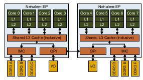
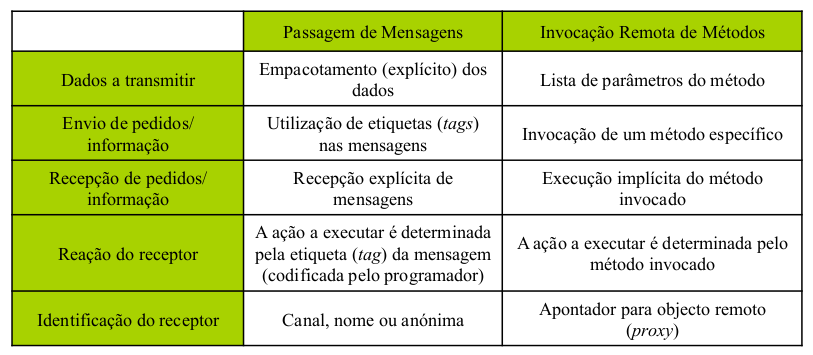

# Introdução

Evolução das arquiteturas de computadores

## Niveis de paralelismo (HW+SW)
- Instrução(ILP)
    - Execução de múltiplas instruções de um programa em paralelo
    - Processamento vetorial
    - Explorado pelo hardware
    - Limitado pelas dependências de dados/controlo do programa
- Tarefas/fios de execução
    - Múltiplos fluxos de instruções de um mesmo programa executam em paralelo
    - Limitado pelas dependências e características do algoritmo
- Processos
    - Múltiplos processos de um mesmo programa ou de vários programas

### Software vs Hardware

Hyper-threading: fios de execução usados para aumentar o ILP

1 processador = 2 processadores?

Não porque parte dos recursos do processador não são duplicados (i.e., são divididos pelos vários fios de execução)

### Memória partilhada vs memória distribuida (HW)

- Memória partilhada
    - Processadores partilham um barramento de acesso à memória
    - As caches reduzem o tráfego no barramento e a latência dos acessos
    - A largura de banda da memória é partilhada $`=>`$ limita a escalabilidade
    - Um valor pode estar replicado em vários sitios $`=>`$ são necessários mecanismos para assegurar a coesão entre as caches dos vários processadores e a memória

- Memória distribuida
    - Cada processador contém a sua própria memória, existindo uma rede de interligação entre os processadores
    - A largura de banda da memória é proporcional ao número de processadores

- Sistemas híbridos
    - Acesso não uniforme à memória (NUMA)

## Desenvolvimento de Aplicações Paralelas

Partição do problema e dos dados a processar
- Identifica oportunidade de paralelismo
    - Define um elevao número de tarefas (de grão fino)
    - Pode obter várias decomposições alternativas
- Duas vertentes complementares da identificação das tarefas:
    - Decomposição dos dados: identifica dados que podem ser processados em paralelo
        - Enfoque dos dados a processar e na sua divisão em conjuntos que podem ser processados em paralelo
    - Decomposição funcional: identifica fases do algoritmo que podem ser efetuadas em paralelo
        - Enfoque no processamento a realizar, dividindo este processamento em tarefas independentes 
- A partição deve obter um número de tarefas, pelo menos, uma ordem de magnitude superior ao número de processadores
    - Introduz flexibilidade nas fases posteriores do desenvolvimento 
- Tarefas de dimensões idênticas facilitam a distribuição da carga
- O número de tarefas deve aumentar com a dimensão do problema

## Paralelismo lógico

- Processos
    - Usado para tarefas não relacionadas
    - Espaço de endereçamento próprio
        - Espaço de endereçamento protegido de outros processos
    - Trocado ao nível do kernel
    - Cada processo tem pelo menos uma thread

- Threads
    - Fazem parte do mesmo trabalho
    - Partilham espaço de endereçamento, código, dados e ficheiros
    - Trocado ao nível do kernel ou do utilizador

Task: sequência de instruções (Em Java: Runnable object)

Thread/Processo: execução de contexto para uma tarefa (Em Java: Thread)

Processador/Core: hardware que corre uma thread/processo

Vantagens de threads:
- variáveis partilhadas
- Fácil comunicação entre tarefas/contextos
    - Multiplas threads coordenam a sua execução e partilham dados através de leitura e escrita de variáveis partilhadas 
Problemas de threads:
- Dependências escondidas são dificeis de detetar
    - Variáveis partilhadas podem ser atualizadas por outras threads
- Dificil prever o desempenho
OOP para o resgate:
- Encapsulamento dos objetos suporta threading
- Classes controlam o acesso a dados partilhados através de sincronização

# OpenMP
Usado para programação em memória partilhada.

O modelo de execução é baseado no modelo fork-join de execução paralela

Paralelismo é especificado através de diretivas, adicionadas pelo programador ao código

É responsabilidade do programador assegurar correção e efeciência dos programas paralelos

OpenMp não resolve problemas tais como:
- Data races, starvation, deadlock ou fraco balanceamento de carga, entre outros
- Mas oferece rotinas para resolver problemas como por exemplo balanceamento de carga ou consistência da memória
A criação/gestão de threads é delegada ao compilador e ao tempo de execução do OpenMP (mais fácil para paralelizar aplicações mas menos controlo sobre o comportamento das threads)
Por predefinição, o número de atividades paralelas é definido em tempo de execução de acordo com os recursos disponíveis (HT conta como cores adicionais)

## Modelo de programação
Um programa OpenMP começa com uma thread(master thread)

Regiões paralelas criam uma equipa de atividades paralelas

Construtores Work-sharing geram trabalho para a equipa processar

Clausulas de partilha de dados especificam como as variáveis são partilhadas dentro de uma região paralela

## Construtores OpenMP
- Construtor paralelo
    - #pragma omp parallel : cria uma equipa de threads
        - Quando uma thread encontra este pragma é criada uma equipa de threads (FORK)
        - A thread que encontra a região torna-se a master thread da nova equipa
        - Todas as threads da equipa executam a região
        - Ao fim da região paralela, todas as threads sincronizam e juntam-se à master thread (JOIN)
- Construtores Work-sharing
    - #pragma omp for : atribuição de iterações do loop a threads
        - As iterações do loop são distribuidas pelas threads da equipa. A distribuição é baseada em chunk_size (1 é o predefinido) e schedule (static é o predefinido)
        - Schedule do loop
            - Static: as iterações são divididas em bocados de tamanho chunk_size e atribuidas às threads da equipa com um escalador round-robin
                - Tem menor overhead que o dynamic
            - Dynamic: os bocados são atribuidos às threads da equipa conforme as threads os solicitam
                - Tem uma abordagem melhor no balancemento da carga do que o static
                - Aumento do chunk_size:
                    - Diminui o overhead de scheduling
                    - Aumenta a possibilidade de problemas de balanceamento
            - Guided: similar ao dynamic mas o tamanho do bocado diminui durante a execução
            - Auto: a seleção da estratégia de scheduling é delegada ao OpenMP
    - #pragma omp sections : atribuição de blocos de código(secção) a threads
        - Cada bloco de secção é dividido através das threads da equipa
        - Cada secção é executada apenas uma vez por threads da equipa
        - Existe uma barreira implicita no final do construtor da secção a não ser que a clausula nowait é especificada
    - #pragma omp single : Restringe um bloco de código a ser executado por apenas uma thread
- Construtores de tarefas
    - #pragma omp task : cria uma pool de tarefas a ser executadas por threads
        - quando uma thread encontra um construtor task, uma task é gerada
        - Thread pode imediatamente executar a task, ou pode ser executada mais tarde por outra thread da equipa
        - OpenMP cria uma pool de tasks para serem executadas pela threads ativas na equipa
        - A diretiva taskwait assegura que as tasks geradas estão completas a partir dela
- Construtores Master e de Sincronização
    - #pragma omp master : restringe o bloco de código a ser executado apenas pela master thread
    - #pragma omp critical : restringe a execução de um bloco de código para apenas uma thread de cada vez
        - Funciona entre equipas (global lock)
    - #pragma omp barrier : faz todas as tarefas esperar pelas restantes que ainda não chegaram
    - #pragma omp taskwait : espera pela conclusão de todas as tarefas filhas
    - #pragma omp atomic : Garante que um local especifico de armazenamento é gerido atomicamente
        - A memória é atualizada atomicamente, não torna o statement atómico, apenas a atualização da memória é atómico
        - O compilador pode usar instruções de hardware especiais para melhor desempenho que usar critical
    - #pragma omp flush : Torna a exibição temporária de memória de uma thread consistente com a memória 
    - #pragma omp ordered : Especifica um bloco de código numa região de loop que vai ser executado pela ordem das iterações do loop
- Data sharing
    - Variáveis dentro de uma região paralela:
        - variáveis declaradas dentro são privadas de cada thread
        - variáveis declaradas fora são partilhadas
    - Cláusulas
        - private(varlist) : cada variável em varlist torna-se privada para cada thread, valor inicial não é especificado
        - firstprivate(varlist) : o mesmo que private, mas as variáveis são inicializadas com o valor que estava antes de entrar na região
        - lastprivate(varlist) : o mesmo que private, mas o valor final é o valor da última iteração do loop
        - reduction(op:var) : o mesmo que lastprivate, mas o valor final é o resultado da redução de valores privados usando o operador op

## Variáveis ambiente
Mais importantes:
- OMP_NUM_THREADS : define o número de threads a usar nas regiões paralelas

# OpenMP 4.0

## Controlar Thread Affinity (Afinidade de threads)

Como agora vários sistemas são agora NUMA, a colocação das threads no hardware pode ter um grande impacto no desempenho
- proc_bind(master | close | spread)
    - A politica master de afinidade de threads instrui o ambiente de execução a designar todas as threads na equipa para o mesmo local que a master thread
    - A política close de afinidade de threads instrui o ambiente de execução a designar as threads para locais perto do local da thread pai
    - O objetivo da política spread de afinidade de threads é para criar uma distribuição esparsa para uma equipa de T threads entre os P locais da partição do pai.
Exemplo:

## Array Section (Seccção de array)
Uma secção de array designa um subset de elementos num array. Pode aparecer apenas em clausulas onde é explicitamente permitido
- [lower-bound:length]
- [lower-bound:]
- [:length]
- [:]
- Quando o tamanho é omitido o predefinido é o tamanho do array menos o lower-bound
- Quando o lower-bound é omitido o predefinido é 0

## Dependências de Tasks (Task dependencies)
OpenMP 4.0 permite especificação de dependências de tasks

A cláusula depend reforça restrições adicionais no scheduling de tarefas partilhadas do mesmo pai
- Dependências estabelecidas apenas entre tasks irmãs 
- #pragma omp task depend (type:list)
    - O tipo é:
        - in: a task gerada vai ser uma task dependente de todas as tasks irmãs anteriormente geradas que fazem referência a pelo menos um dos itens da lista com uma clásula out ou inout
        - out ou inout: a task gerada vai ser uma task dependente de todas as tasks irmãs anteriormente geradas que fazem referência a pelo menos um dos itens da lista com uma cláusula in, out ou inout
    - lista é uma lista de variáveis que pode conter sub arrays

Dependência de fluxo (RAW - Read After Write)

Anti-dependência (WAR - Write After Read)

Dependência de Output (WAW - Write After Write)

## Contrutor taskyield
Especifica que a task corrente pode ser suspendida em favor da execução de uma task diferente

## Reduções definidas pelo utilizador
É agora permitido criar novos operadores de redução, que podem ser usados em clausulas de redução

## Construtor de cancelamento
Ativa o cancelamento da região de enclosão mais interna do tipo especificado (parallel, sections, for, taskgroup)

## Construtores SIMD
O construtor simd pode ser aplicado a um loop para indicar que o loop pode ser tranformado num loop SIMD (pode ativar vetorização de loops paralelos ou sequenciais)

O construtor declare simd pode ser aplicado a funções para permitir a criação de uma ou mais versões que podem processar multiplos argumentos usando instruções SIMD de uma única invocação de um loop SIMD (pode indicar ao OpenMP para criar versões de funções que podem ser invocadas através de SIMD lanes)

O construtor loop SIMD especifica um loop que pode ser executados concorrentemente usando instruções SIMD e que essas iterações vão ser também executadas paralelamente por threads da equipa

ver slides PCP4 para Device Constructs, Target Construct e Teams Construct a partir do slide 25

# Programação Paralela em Java

Beneficios de programação concorrente
- Programas que requerem multiplas atividades
- Melhor disponibilidade do serviço
- Suporta mensagens/chamadas assincronas
- Tira vantagem do paralelismo de sistemas multi-core/multi-CPU
- Requer concorrência

Problemas introduzidos pela programação concorrente
- Segurança: inconsistências na execução de programas
- Vivacidade: deadlocks na execução de programas
- Introduz não-determinismo na execução do programa
- Em sistemas OO: há menos objetos que atividades assincronas
- Não é util para execução local de métodos num modelo de chamada/resposta
- Introduz overhead devido à criação, scheduling e sincronização de threads

Abordagens tradicionais à concorrência
- Modelos baseados em fork/join, cobegin/coend, and parfor
    - Sincronização é feita usando semáforos, barreiras ou monitores 
- Processo Ativo(CSP)
    - Realiza processamento através de um corpo ativo, interagindo através de passagem de mensagens (blocking synchronous, synchronous non-blocking ou asynchronous)

## Concorrência em aplicações orientadas a objetos

- Chamadas sincronas (modelos tradicionais): o cliente é bloqueado enquanto que o método é executado pelo servidor, mesmo que não haja valor de retorno
- Chamadas assincronas sem valor de retorno: quando o método invocado não retorna um valor, o cliente pode continuar a correr simultaneamente com a execução do método no servidor
- Chamadas assincronas com retorno: quando há um valor a retornar, a invocação pode também ser assincrona, há três alternativas de modo a obter o resultado:
    - Sincrono deferido: o cliente faz uma segunda invocação para o servidor para obter o resultado
    - Com retorno da chamada: O servidor realiza uma invocação de um método predefinido do cliente quando a tarefa é completa
    - Com futuro: A invocação é delegada a outro objeto que guarda o resultado

Formas de paralelismo em Java
- Interface Runnable
- Classe java.lang.Thread (implementa também a interface Runnable)
- Especificação de sincronização (aumenta segurança)
    - Blocos de código e métodos synchronized (mutex) 
    - Modelo de memória Java: uma thread de execução pode manter cópias de valores locais. Blocos synchronized assegura que todas as threads veem valores consistentes
    - Com monitores
- Padrões para melhorar segurança
    - Objetos sem estado ou imutáveis 
    - Objetos inclusos em outros objetos
- Padrões para melhorar vivacidade
    - Métodos que apenas leem o estado do objeto geralmente não precisam de ser sincronizados
    - Não há necessidade de sincronizar as variáveis que são apenas escritas uma vez
    - Sincronização separada para aceder partes do estado (ou dividir o estado em dois objetos)
    - Recursos devem ser acedidos pela mesma ordem
- Uso de streams paralelas em Java

# Medição e Otimização de desempenho em memória partilhada

## Principios
- Isolar de fatores externos
    - Considerar o overhead da medição
    - Repetir a medição
- Documentar a experiência para ser reproduzida por outros
    - hardware, versões do software, estado do sistema...
- Resolução do relógio
    - Precisão: diferença entre tempo medido e tempo real 
    - Resolução: unidade de tempo entre imcrementos do relógio (em principio, não é possível medir eventos menores que a resolução do relógio)

## Quanto tempo é necessário para executar uma aplicação
- CPU time :
    - tempo dedicado exclusivamente à execução do programa
    - não depende de outras atividades do sistema
- Wall time (real time):
    - tempo medido desde o inicio até ao fim da execução
    - depende da carga do sistema, I/O, etc

## Como combinar os resultados de várias medições
- Média
    - Afetada por valores extremos altos/baixos
    - adicionalmente: mostre o desvio entre as medidas (desvio padrão)
- Melhor medida
    - Valor em condições ideais
- Média dos k-melhores(k-best)
    - Remove outsiders 
- Mediana
    - Mais robusto para grandes variações

## Apresentação dos resultados
Apresentar resultados de uma maneira legível (compacta)

Colocar legendas em tabelas e gráficos

Não estrapolar valores

Use incrementos constantes no eixo X e no eixo Y, representar o 0 (ou 1)

Justificar resultados obtidos, investigar valores não esperados

## Erros comuns
Não documente ambiente experimental/inclusão de detalhes irrelevantes

Não repetir a experiência

Incluir I/O time

Não considerar overhead de leitura de tempo/resolução

Não aquecer a cache (e JIT no Java)

## Qual é a definação de desempenho
Pode ser: tempo de execução, efeciência, escalabilidade, necessidade de memória, troughput, latência, custo do projeto/custo de desenvolvimento, portabilidade, potencial reuso

Medida mais comum em aplicações paralelas: speed-up: tempo sequencial / tempo paralelo

## Lei de Amdahl
A componente sequencial de uma aplicação limita o speed-up maximo

$`1/((1-p)+p/s)`$
- S - número de recursos (cores)
- P . fração(percentagem) que corre em paralelo
Maximo speed-up = $`1/(1-p)`$ = $`1/fracaoSequencial`$

## Estudo experimental e avaliação de implementações
- Computação paralela tem uma forte componente experimental
    - Muitos problemas são demasiado complexos para a resolução ser baseada apenas em modelos
    - Modelos de desempenho podem ser calibrados com dados experimentais
- Como assegurar que os resultados são precisos e reproduziveis?
    - Realizar multiplas experiências e verificar resolução do relógio
    - Resultados não devem mudar entre pequenas diferenças: menos de 2-3%
- Perfil de execução
    - Reunir vários dados de desempenho: número de mensagens, volume de dados transmitidos
    - Pode ser implementado por ferramentas específicas ou instrumentando diretamente o código (Há sempre um overhead introduzido na aplicação)
- Anomalias Speed-up (superlinear (superior ao número de processadores) - na maioria dos casos é devido a efeitos de cache)

## Técnicas para medir o tempo-perfil de uma aplicação (profiling)
- Polling
    - A aplicação é periodicamente interrompida para recolher dados de desempenho
    - exemplo: gprof
- Instrumentação
    - O código é introduzido (pelo programador por por ferramentas) para recolher dados de desempenho sobre eventos importantes
    - Tende a produzir melhores resultados mas também produz mais interferência (overhead)
    - exemplo: valgrind

## Algumas razões para a falta de escalabilidade
- percentagem de computação executada sequencialmente (lei de Amdahl)
- Limitação da bandwidth da memória/cache
- Paralelismo de grão fino (excessivo overhead de paralelismo)
- Excessivas sincronizações de tasks (devido a dependências)
- Má distribuição de carga
Ver slides CP3 para maior aprofundamento sobre cada uma a partir do slide 12

# Passagem de mensagens

Conceitos básicos:
- Especificação de atividades paralelas por meio de processos com espaços de endereço separados
    - Sem memória partilhada entre processos $`=>`$  paralelismo com passagem de mensagens
    - Processos podem ser idênticos(Single Process Multiple Data-SPMD, MPI) ou não (Multiple Instructions Multiple Data-MIMD, PVM)
- As atividades paralelas comunicam entre portas ou canais
    - Mensagem enviada e recebida de forma explicita (de/para porta ou canal) 
- Os dados devem ser explicitamente organizados em mensagens
- Existem primitivas de comunicação mais sofisticadas (transmissão, redução, barreira)

## MPI (Message Passing Interface)

Standard para passagem de mensagens, resultado de um esforço para fornecer uma maneira de desenvolver aplicações paralelos portáveis (baseado em memória distribuida)

Baseado mo modelo SPMD (o mesmo processo é executado em todas as máquinas), passagem de mensagens com entrega de mensagens por ordem

Implementado como uma biblioteca de funções

Modelo Single Program Multiple Data (SPMD)
- O mesmo executável é lançado numa conjunto de máquinas
    - Execução assincrona do mesmo programa
    - Cada processo tem um identificador único
- O rank de cada processo é usado para definir o comportamento especifico de cada processo
    - Fluxo de controlo de processo
    - Processamento de dados e comunicação entre processos

### Estrutura de um programa MPI
- Inicializar a biblioteca: MPI_Init
- Obter informação para processo: 
    - Obter número total de processos: MPI_Comm_size
    - Obter o id do processo atual: MPI_Comm_rank
- Executar no corpo do programa: MPI_Send/MPI_Recv/etc
- Cleanup: MPI_Finalize
- Compile: mpicc file
- execute: mpirun –np numberOfProcesses a.out

### Funcionalidades
- Comunicação ponto a ponto entre processos
    - int MPI_Send(void *buf, int count, MPI_Datatype datatype, int dest, int tag, MPI_Comm comm)
    - int MPI_Recv(void *buf, int count, MPI_Datatype datatype, int source, int tag, MPI_Comm comm, MPI_Status *status)
    - Cada processo é identificado pelo seu rank no grupo
        - dest/source indica o destino/fonte da mensagem
        - Por predefinição existe um grupo com todos os processos: MPI_COMM_WORLD
    - A tag pode ser usada para fazer a distinção entre mensagens
    - MPI_Recv espera pela chegada da mensagem com as caracteristicas necessárias
    - MPI_ANY_SOURCE e MPI_ANY_TAG pode ser usado para identificar qualquer fonte/qualquer tag
    - Overhead: Tempo de transferência de mensagem (cópia na rede, transmissão de rede, entrega no buffer do receptor)

Ver slides CP4 a partir do slide 8 para as restantes funcionalidades

# Middleware de Aplicações Paralelas/Distribuídas

Principais aspetos a gerir pelo Middleware
- Como comunicam as entidades (objetos, componentes ou processos)?
- Como são identificadas as entidades?
- Qual o ciclo de vida das entidades (como são criadas e destruídas)?

## Comunicação entre entidades
- Invocação direta de métodos ou procedimentos em aplicações não distribuidas: podem ser implementadas através de um salto para o endereço correspondente ao método/procedimento a realizar, sendo os parametros passados na pilha ou em registos do processador
- Primitivas do tipo send(host, port, message) e recv([host],port):
    - Em aplicações distribuídas clássicas, baseadas em processos, as entidades podem comunicar através da passagem de mensagens, por exemplo, utilizando primitivas do tipo send e recv
    - A primitiva send pode ser implementada através do envio de um pacote de informação ao host indicado, contendo a identificação do destinatário (e.g., port) e a mensagem
    - No recetor é necessário ativar o processo recetor à espera da mensagem e este deve extrair a mensagem do pacote de informação recebido
- Invocação remota de métodos
    - Geralmente utilizado em aplicações distribuídas desenvolvidas através de componentes ou objetos
    - Pode ser implementado "colando" um procurador (stub) junto do cliente, procurador que implementa a mesma interface que o objeto ou componente remoto e que o substitui de forma transparente. Este stub converte cada invocação de método numa mensagem enviada ao objeto remoto
    - Junto ao objeto remoto existe um tie que descodifica a mensagem e invoca o método correspondente no objeto local

## Identificação das entidades
Em aplicações não distribuídas, uma entidade pode ser identificada diretamente pelo seu endereço de memória(referência).

Em aplicações distribuídas pode ser realizada através de:
- um par (máquina, endereço) ou (máquina, porta)
- um servidor de nomes que permite a utilização de nomes abstratos para identificar as entidades. Cada entidade pode registar-se nesse servidor de nomes, o qual é utilizado pelos clientes para obter referências para entidades registadas

O esquema de identificação das entidades deve ser universal, de forma a ser possível passar os identificadores entre máquinas
- Entidades de primeira classe: podem ser copiadas e passadas como parametros de métodos

## Ciclo de vida das entidades
- Para que uma entidade (objeto, componente ou processo) seja criado numa máquina é necessário que o executável correspondente se encontre nessa máquina ou que seja descarregado juntamente com o pedido de criação (processo conhecido por deployment)
- A criação de entidades pode ser efetuada de forma manual (correndo o executável na máquina remota), ou utilizando uma fábrica de entidades. Neste último caso é necessário ativar a fábrica
- Podem existir várias fábricas de objetos (nomeadamente, uma por classe, em cada nodo), sendo necessário introduzir um serviço para localizar as várias fábricas
- A destruição automática dos objetos em aplicações distribuídas é mais complexa, uma vez que é necessária comunicação entre os diversos nodos para efetuar a contagem das referências existentes

## MPI vs RMI

## Exemplos de Middleware
- PVM(Parallel Virtual Machine) e MPI(Message Passing Interface)
    - o envio e a receção de mensagens entre processos (na mesma máquina ou em máquinas diferentes) 
    - primitivas para o envio e receção de mensagens (síncronas/assíncronas e bloqueantes e não bloqueantes)
    - identificação é realizada através de portas, existindo primitivas para dinamicamente lançar um processo remoto(PVM)
- CORBA(Common Object Request Broker Architecture)
    - arquitetura que permite a inter-operabilidade de componentes
    - baseada na definição de interfaces de componentes (IDL-Interface Definition Language) e num serviço de nomes que permite localizar componentes e invocar métodos (ORB-Object Request Broker)
    - a inter-operabilidade é assegurada através da utilização de um protocolo de comunicação baseado em TCP/IP (IIOP - Internet Inter-ORB Protocol), que define a forma como a informação que é trocada entre ORB's
- Java RMI e Java RMI-IIOP: permite a invocação de métodos entre objetos Java distribuídos. O serviço de nomes pode ser fornecido pelo RMI Registry ou por JNDI(Java Naming and Directory Interface). RMI-IIOP utiliza protocolos compatíveis com CORBA
- J2EE (Java 2 Enterprise Edition): especificação para desenvolvimento de aplicações empresariais baseadas em componentes(Enterprise Java Beans), distribuídos e com várias camadas. Suporta o desenvolvimento de componentes para a apresentação (JSP e Servlets), para a camada de computação (Session Beans) e para a camada de BD (Entity Beans). Suporta ainda transações, segurança com autenticação, e passagem de mensagens
- .NET Remoting: alternativa da Microsoft ao desenvolvimento de aplicações empresariais distribuídas. Incluída na plataforma .NET, suporta a invocação remota de métodos e a gestão do ciclo de vida de objetos distribuídos

## Java RMI/IIOP
Middleware utilizado para efetuar invocações de métodos entre objetos em diferentes JVM ou em componentes compatíveis com CORBA.

Cada objeto servidor deve exportar uma ou várias interfaces, existindo um utilitário rmic para explicitamente gerar o stub e o tie.

O objeto servidor regista-se no serviço de nomes (JNDI) com um nome abstrato, sendo esse serviço utilizado pelos clientes para obterem uma referência ao objeto remoto.

O deployment é manual, existindo um protocolo que permite que os objetos servidores sejam descarregados e ativados automaticamente (derivando da classe Activable).

Na invocação remota de métodos, os objetos declarados como remotos são passados por referência, enquanto os outros objetos são sempre por valor:

