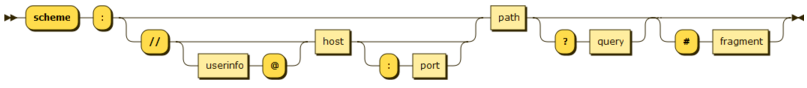

# Processamento e Representação de Conhecimento

TODO: ler slides Linked Data Engineering

## Linked Open Data

É um método de publicação de dados estruturados para que possam ser interligados e tornarem-se mais utéis através de queries semânticas.

Usa tecnologias Web padrão como HTTP, RDF e URI's de forma a servirem páginas para humanos, mas também para partilhar informação de forma a que os computadores compreendam automaticamente. Parte da visão do Linked Data é que a internet se torne numa base de dados global.

Linked Data pode ser também open data, e que nesse caso é normalmente apelidado de Linked Open Data (LOD). A única diferença é que as licensas são abertas (open licenses).

### Principios

- Usar URI's para nomear(identificar) coisas.
- Usar HTTP URIs para que essas coisas possam ser pesquisadas (interpretadas).
- Forneça informações úteis sobre o que um nome identifica quando é pesquisado, usando padrões abertos, como RDF, SPARQL, etc.
- Referenciar outras coisas usando nomes baseados em HTTP URI ao publicar dados na Web.

### Datasets

- governamentais
  - data.gov.uk
  - dados.gov.pt

### URI - Uniform Resource Identifier

O URI é uma string de caracteres que identifica inequivocamente um recurso específico. Para garantir a uniformidade, todos os URIs seguem um conjunto predefinido de regras de sintaxe, mas também mantêm a extensibilidade por meio de um esquema de nomenclatura hierarquicamente definido separadamente.

Esta identificação permite a interação com representações duma rede, geralmente a World Wide Web, usando protocolos específicos. A forma mais comum de URI é o URL (Uniform Resource Locator), frequentemente chamado de endereço web. Mais raramente usado é o URN (Uniform Resource Name), que foi projetado para complementar URLs, fornecendo um mecanismo para a identificação de recursos em namespaces específicos.

#### Definição

A sintaxe genérica do URI consiste em uma sequência hierárquica de cinco componentes:

- __scheme__ (obrigatório): scheme seguido por dois-pontos (:), consistindo de uma sequência de caracteres iniciados por uma letra e seguida por qualquer combinação de letras, dígitos, mais (+), ponto (.) Ou hífen (-). Exemplos: http, https, ftp, mailto, file, data e irc
- __authority__ (opcional): authority precedido por dois slashes (//) compreende:
    - __userinfo__ (opcional): que pode consistir em um nome de utilizador e uma senha opcional precedida por dois pontos (:), seguida por um símbolo arroba (@). O uso do formato "username : password" foi suspenso por motivos de segurança.
    - __host__ (opcional): host consistindo em um nome registrado ou um endereço IP
    - __port__ (opcional): porta precedida por dois pontos (:)
- __path__ (obrigatório): consiste numa sequência de segmentos de caminho separados por uma barra (/). Um caminho é sempre definido para um URI, embora o caminho definido possa ser vazio (comprimento zero). Um segmento também pode ser vazio, resultando em duas barras consecutivas (//) no componente de caminho. Se o componente authority estiver presente, o componente de caminho deverá estar vazio ou começar com uma barra (/). Se o componente authority estiver ausente, o caminho não poderá começar com um segmento vazio, ou seja, com duas barras (//)
- __query__ (opcional): query precedido de um ponto de interrogação (?) contendo uma query string de dados não hierárquicos. Por convenção o mais frequentemente é uma sequência de pares de atributos e valores separados por um delimitador
- __fragment__ (opcional): fragmento precedido por hash (#). Contém um identificador que fornece a direção a um recurso secundário, como por exemplo um cabeçalho

Os carecteres permitidos dentro de um URI são os caracteres ASCII (letras minúsculas e maiúsculas do alfabeto inglês moderno, os números árabes, hífen, ponto final, underscore e til). Quaisquer outros carecteres devem ser codificados pelo símbolo de percentagem.

Os caracteres : / ? # [ ] @ são reservados para serem usados como delimitadores dos componentes genéricos do URI e devem ser codificados com o simbolo de percentagem.

Os caracteres ! $ & ' ( ) * + , ; = são permitidos pela sintaxe genérica do URI se forem usados na informação do utilizador, no host e no caminho como delimitadores.

Adicionalmente, : e @ podem aparecer sem codificação no caminho, query e fragmento. Para além disso ; ? / podem aparecer sem codificação como dados dentro da query ou do fragmento.



### RDF - Resource Description Framework

É um método geral para descrição ou modelagem conceitual de informação que é implementada em recursos web, usando uma variedade de notações de sintaxe e formatos de serialização de dados. É semelhante às abordagens de modelagem conceitual clássica (como diagramas entidade-relacionamento ou diagramas de classe).

Baseia-se na ideia de fazer declarações sobre recursos (em particular, recursos da web) em expressões da forma sujeito-predicado-objeto, conhecidas como triplos. O sujeito denota o recurso e o predicado denota traços ou aspectos do recurso e expressa uma relação entre o sujeito e o objeto.

RDF é um modelo abstrato com vários formatos de serialização, portanto, a codificação específica para recursos ou triplos varia de formato para formato.

Este mecanismo para descrever recursos é um componente importante da atividade da Web Semântica do W3C: um estágio evolutivo da World Wide Web no qual software pode armazenar, trocar e usar informações legíveis por máquinas, permitindo aos utilizadores lidar com a informação com maior eficiência e certeza. O modelo de dados simples do RDF e a capacidade de modelar conceitos abstratos e díspares também levaram ao seu uso crescente em aplicações de gestão de conhecimento não relacionados com a atividade da Web Semântica.

Uma coleção de instruções RDF representa intrinsecamente um multi-grafo rotulado e direcionado. Contudo, os dados RDF podem ser também armazenados em bancos de dados relacionais.

Como o RDFS e o OWL demonstram, é possível construir linguagens de ontologia adicionais no RDF.

#### Vocabulário

O vocabulário definido pela RDF é o seguinte:

- Classes
    - rdf
        - rdf:XMLLiteral – a classe dos valores literais do XML
        - rdf:Property – a classe das propriedades
        - rdf:Statement – a classe dos RDF statements
        - rdf:List – a classe das listas RDF
        - rdf:nil – uma entidade de rdf:List representando a lista vazia
    - rdfs
        - rdfs:Resource - o recurso a classe dos recursos, tudo
        - rdfs:Literal - a classe dos valores literais
        - __rdfs:Class__ - a classe das classes
        - rdfs:Datatype - a classe dos datatypes RDF
        - rdfs:Container - a classe dos containers RDF

- Properties
    - rdf
        - __rdf:type__ - uma entidade de rdf:Property usada para declarar que um recurso é uma entidade de uma classe
        - rdf:first - o primeiro item numa lista RDF
        - rdf:rest - o resto da lista RDF após rdf:first
        - rdf:value - propriedade idiomática usada para valores estruturados
        - rdf:subject - o sujeito de um RDF statement
        - rdf:predicate - o predicado de um RDF statement
        - rdf:object - o objeto de um RDF statement
    - rdfs
        - __rdfs:subClassOf__ – o sujeito é uma subclasse de uma classe
        - __rdfs:subPropertyOf__ – o sujeito é uma subpropriedade de uma propriedade
        - __rdfs:domain__ – o dominio do sujeito que é uma propriedade
        - __rdfs:range__ – o contradominio do sujeito que é uma propriedade
        - rdfs:label – um nome legível humanamente para o sujeito
        - rdfs:comment – uma descrição do sujeito que é um recurso
        - rdfs:member – um membro do sujeito que é um recurso
        - rdfs:seeAlso – outras informações sobre o sujeito que é um recurso
        - rdfs:isDefinedBy – a definição de um sujeito que é um recurso

#### Formatos de serialização

- Turtle, formato compacto e human-friendly
- N-Triples, um formato muito simples, fácil de analisar e baseado em linha, mas que não é tão compacto quanto o Turtle
- N-Quads, um superconjunto de N-Triples, para serializar vários grafos RDF
- JSON-LD, uma serialização baseada em JSON
- N3 ou Notation3, uma serialização não padrão muito semelhante ao Turtle, mas que possui alguns recursos adicionais, como a capacidade de definir regras de inferência
- RDF/XML, uma sintaxe baseada em XML que foi o primeiro formato padrão para serializar o RDF
- RDF/JSON, uma sintaxe alternativa para expressar triplos RDF usando uma notação JSON

### OWL - Web Ontology Language

TODO: Quando dermos, preencher

### SPARQL - SPARQL Protocol and RDF Query Language

É uma query language de RDF, ou seja, uma linguagem de consulta semântica para bancos de dados, capaz de recuperar e manipular dados armazenados no formato RDF.

O SPARQL permite que uma query consista em padrões de triplos, conjunções, disjunções e padrões opcionais.

#### Queries

No caso de queries que lêm dados da base de dados o SPARQL especifica quatro variações diferentes para diferentes objetivos.

- SELECT query: Usado para extrair valores brutos de um terminal SPARQL, os resultados são devolvidos num formato em tabela
- CONSTRUCT query: Usado para extrair informações do terminal SPARQL e transformar os resultados em triplos RDF válidos
- ASK query: Usado para fornecer um resultado True/False para uma consulta num terminal SPARQL
- DESCRIBE query: Usado para extrair um grafo RDF do terminal SPARQL, cujo conteúdo é deixado para o terminal decidir com base no que considera como informações úteis

Cada um desses formatos usa um bloco WHERE para restringir a consulta, embora, no caso da consulta DESCRIBE, o WHERE seja opcional.

Para além disso após o WHERE é possível usar blocos tais como LIMIT, GROUP BY, etc. Na query pode ser usado por exemplo o count.

TODO: Completar

## Linguagens

- RDF
- RDFS
- OWL/SKOS
- SPARQL/SevQL/Cypher

## FOAF (friend of a friend)

É uma ontologia legível pelas máquinas que descreve pessoas, as suas atividades e as suas relações com outras pessoas e objetos. Qualquer um pode usar o FOAF para se descrever. O FOAF permite que grupos de pessoas descrevam redes sociais sem a necessidade de um banco de dados centralizado.

Usa o RDF e o OWL para descrever a ontologia.

## Ontologia

### O que é um ontologia?

Representação (Especificação) de conhecimento.

Uma ontologia tem duas partes:
- Estrutura (Onde são definidas as classes, as relações e as propriedades)
- População (Onde são definidos individuos(entities), relações entre individuos e propriedades de individuos)

Todo o conhecimento implicito tem de se tornar explicito para as máquinas perceberem do que se trata.

Tanto a informação da estrutura como da população é representada em triplos (RDF).

Estrutura de um triplo:
```
subject (sujeito)       predicate (predicado)       object (objeto)
      URI                        URI                 URI ou literal
```
Properties:
- Individuo Data_Properties Valor (propriedade)
- Individuo Object_Properties Individuo (relação)

Estrutura das properties:
```
Property(
            domain (classe) => dominio
            range (35 primitivos do xml schema ou classe) => contradominio
        )
```

## Turtle

```turtle
sujeito1 prop1 sujeito2 ; #permite omitir o sujeito
    prop2 "valor1" .

sujeito2 prop3 e1 , #permite omitir sujeito e predicado
               e2 , #permite omitir sujeito e predicado
               e3 .
```